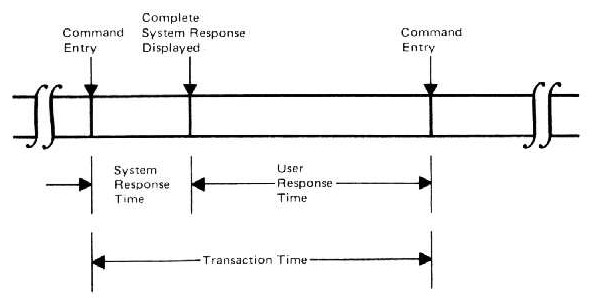
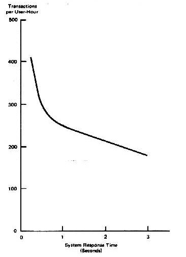
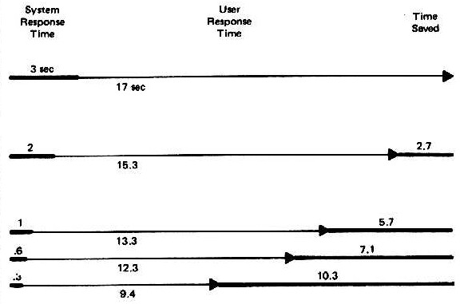
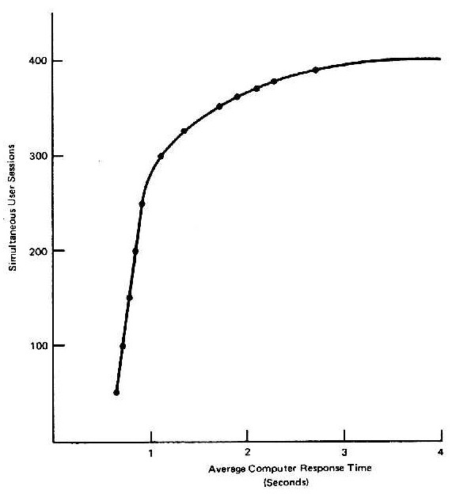
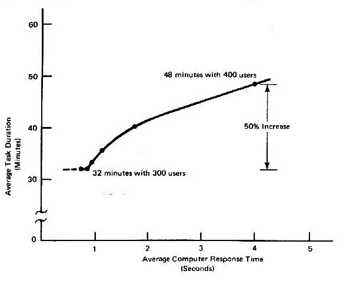
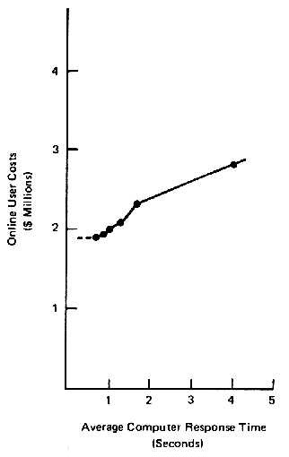
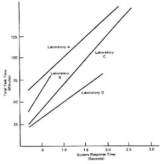
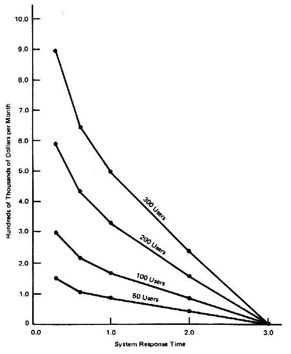

# The Economic Value of Rapid Response Time 

[Jim Elliott's Mainframe Blog: The Economic Value of Rapid Response Time](https://jlelliotton.blogspot.com/p/the-economic-value-of-rapid-response.html)

이 논문은 1982년 11월에 발표되었으며, IBM의 Thomas J. Watson 연구소의 시스템 성능 및 기술 이전 담당 매니저인 Walter J. Doherty와 IBM의 General Products Division 본부의 자문 엔지니어인 Ahrvind J. Thadani가 작성했습니다.

컴퓨터와 사용자가 서로 기다리지 않고 상호작용할 수 있을 때, 생산성은 급증하고, 컴퓨터에서 처리되는 작업의 비용은 크게 줄어들며, 직원들은 더 많은 만족감을 느끼고 작업의 질이 향상되는 경향이 있습니다. 그러나 대부분의 온라인 컴퓨터 시스템은 이러한 균형을 이루지 못하며, 많은 경영진은 그러한 균형이 경제적 및 기술적으로 가능하다는 사실을 알지 못합니다.

사실, 한때는 최대 2초 정도의 상대적으로 느린 응답 시간이 허용될 수 있다고 여겨졌습니다. 이는 사용자가 다음 작업에 대해 생각하는 시간을 고려했기 때문입니다. 하지만 최근의 빠른 응답 시간에 대한 연구는 이 이론이 사실과 일치하지 않음을 보여주고 있습니다. 생산성은 응답 시간이 줄어듦에 따라 비례 이상으로 증가합니다. 이 논문은 이러한 연구 중 일부와 오늘날 비즈니스에서  가장 큰 과제 중 하나인 생산성 증가와 비용 절감의 의미에 대해 설명합니다.

## 배경

트랜잭션(작업, 처리)은 터미널에서 사용자 명령과 시스템의 응답으로 구성됩니다. 이는 온라인 시스템 사용자에게 기본적인 작업 단위입니다. 트랜잭션은 두 가지 시간 순서로 나눌 수 있습니다. (그림 1. 참조)

- **사용자 응답 시간(User Response Time)**: 사용자가 하나의 명령에 대한 응답을 완전히 받은 후 다음 명령을 입력할 때까지의 시간 간격. 이는 종종 "생각 시간(think time)"이라고 불립니다.
- **시스템 응답 시간(System Response Time)**: 사용자가 명령을 입력한 순간부터 터미널에 완전한 응답이 표시될 때까지의 시간 간격. 시스템 응답 시간은 다음 두 가지로 나눌 수 있습니다.
	- 컴퓨터 응답 시간: 컴퓨터가 사용자 명령을 처리하고 서비스를 제공하는 데 실제로 소비하는 시간.
	- 통신 시간: 명령이 컴퓨터로 전송되고 응답이 돌아오는 데 걸리는 전송 시간.

온라인 시스템이 처음으로 비즈니스 세계에 확산되기 시작했을 때, 당시 IBM의 포킵시(Poughkeepsie) 연구소에 있던 심리학자 로버트 B. 밀러(Robert B.Miller)와 같은 사람들은 컴퓨터가 응답하는 데 2초가 가장 긴 대기 시간이어야 한다고 주장했습니다.

- 로버트 B. 밀러: [[Response Time in Man-Computer Conversational Transactions]]

이 시간 간격은 온라인 시스템 설계자와 관리자들이 해결해야 할 과제로 떠올랐습니다. ㅏ기 온라인 시스템에서 이 목표를 달성하는 것은 쉽지 않았지만, 사람들은 컴퓨터의 응답을 기다리는 동안 사용자가 트랜잭션 흐름에서 다음 단계를 생각하고 있다는 생각에 위안을 삼았습니다. 여기에는 시스템 응답 시간이 길어져도 사용자가 가능한 한 빠르게 생각하고 있다는 암묵적인 믿음이 포함되어 있었습니다.

오늘날의 온라인 시스템은 초당 수백만 개의 명령을 쉽게 처리할 수 있으며, IBM의 가장 강력한 System/360 기계에서 사용 가능한 것보다 훨씬 더 큰 메모리를 가지고 수백 명의 사용자에게 각각 2초 이내에 응답할 수 있습니다. IBM의 Thomas J. Watson 연구소의 Walter J. Doherty는 시스템 성능의 이 빠른 개선의 중요성을 처음으로 인식한 사람 중 한 명이었습니다.

그는 IBM 연구 부서의 컴퓨팅 시스템 책임자인 Richard P. Kelisky와 함께 1979년에 그들의 관찰에 대해 다음과 같이 썼습니다.

"시스템 응답 시간이 1초씩 느려질 때마다 사용자가 다음 명령을 수행하는 데 걸리는 시간도 비례하여 늘어납니다. 이 현상은 개인의 집중력 범위와 관련이 있는 것으로 보입니다. 각 시스템 응답 후 사용자가 생각할 시간을 갖는다는 전통적인 모델은 부정확한 것으로 보입니다. 대신 사람들은 짧은 기간의 정신적 기억 버퍼에 일련의 행동 계획을 가지고 있는 것 같습니다. 시스템 응답 시간이 길어지면 이러한 사고 과정이 방해를 받는 것으로 보이며, 이로 인해 행동 순서를 다시 생각해야 할 수도 있습니다."

**그림 2.**

**그림 3.**

Doherty의 연구에 영감을 받아 IBM 산호세 연구소의 Arvind J. Thadhani는 시스템 응답 시간이 줄어들수록 프로그래머가 한 시간 동안 완료하는 트랜잭션의 수가 눈에 띄게 증가하며, 시스템 응답 시간이 1초 미만으로 떨어지면 그 수가 극적으로 증가한다고 제안했습니다.

예를 들어(그림 2. 참조), 응답 시간이 3초일 때 Thadhani는 프로그래머가 한 시간에 약 180개의 트랜잭션을 실행한다고 발견했습니다. 그러나 응답 시간을 0.3초로 줄이면 프로그래머가 시간 동안 실행할 수 있는 트랜잭션 수가 371로 급증하여 106% 증가합니다. 다시 말해, 시스템 응답 시간이 2.7초 줄어들면 사용자의 시간이 10.3초 절약됩니다.(그림 3. 참조) 이처럼 겉으로 보기에는 미미해 보이는 시간 절약이 생산성의 상당한 증가로 이어지는 발판이 됩니다.

## 성과
조직이 온라인 컴퓨팅에서 개선된 응답 시간, 궁극적으로 1초 미만의 응답 시간을 제공함으로써 얻을 수 있는 잠재적 이점은 상당한 비용 절감, 개인 생산성 향상, 프로젝트 일정 단축, 그리고 더 나은 작업 품질을 포함합니다. 이러한 이점은 컴퓨팅 상황에 내재되어 있으며, 수행되는 작업의 종류에 의존하지 않습니다. 이는 다양한 환경에서 입증된 바 있습니다. 이제 이러한 이점들을 더 자세히 살펴보겠습니다.

## 상당한 비용 절감
여기저기서 몇 초씩 시간을 절약하는 것이 별로 중요하지 않게 보일 수 있지만, 이러한 시간은 빠르게 누적되어 커다란 금액을 나타내며, 이는 더 빠른 시스템 응답을 제공하기 위해 더 큰 프로세서를 설치해야 하는 경우 그 비용을 충분히 정당화할 만큼 커집니다. 미국 국립보건원(NIH)이 이를 잘 보여줍니다.

1979년에 설치된 시스템은 300명의 동시 사용자가 워드 프로세싱, 프로그래밍, 컴퓨팅 및 원격 작업 입력 기능을 사용할 수 있도록 설계되었으며, 트랜잭션의 80%가 0.5초 이내에 처리되도록 설계되었습니다. 이 브리핑에서 '작업(task)'이라고 불리는 터미널 작업 세션은 월평균 95,000건에 달했습니다. 설계 당시에는 시스템이 사용자들의 요구를 충족시켰지만, 수요가 증가하면서 서비스 수준을 유지하는 능력이 위협받고 있었습니다.(그림 4. 참조)

동시 사용자의 수는 거의 400명에 달했고, 18개월 안에 500명에 이를 것으로 예상되었습니다. 390명의 사용자가 있을 때 컴퓨터 응답 시간은 평균 4초로 악화되었고, 평균 작업 완료 시간이 50% 증가하여 32분에서 48분으로 늘어났습니다.(그림 5. 참조)

이 문제를 해결하기 위해 NIH 컴퓨터 센터장 Joseph D. Naughton은 프로세서를 업그레이드할 것을 제안했습니다. 그는 시스템의 성능 저하로 인해 NIH 사용자가 매월 추가로 22,500 시간을 터미널에서 소비하게 되었지만, 처리하는 작업의 수는 동일하다는 것을 관찰했습니다. 이 시간에 대한 시스템 및 사용자 비용은 월 $900,000로 추정되었으며(그림 6. 참조), 이는 500명의 동시 사용자가 1초 미만의 응답 시간을 제공받을 수 있는 새로운 프로세서의 추가 비용보다 15배나 높았습니다. NIH의 경우, 프로세서 업그레이드 비용은 사용자 시간 절감 및 낮은 작업 비용 복원으로 충분히 정당화 되었습니다.

**그림 4.**

**그림 5.**

**그림 6.**

## 개인 생산성 향상
개인 생산성 향상은 아마도 빠른 응답 시간에서 얻을 수 있는 가장 중요한 이점일 것입니다. Thadhani의 연구 결과가 발표된 후, 그의 연구와 Doherty의 연구를 확인하고 개선된 응답 시간, 특히 1초 미만의 응답 시간이 개인 생산성에 미치는 영향을 조사하기 위한 IBM 프로젝트가 다수 시작되었습니다. 그중 하나는 시스템 제품 부서(SPD)와 관련된 연구입니다. 여러 온라인 애플리케이션 중에서 SPD 연구소는 엔지니어들이 보드, 카드, 칩과 같은 오늘날 컴퓨터의 구성 요소를 물리적으로 설계할 수 있도록 돕기 위해 고성능 그래픽을 제공합니다. 엔지니어들은 그래픽 이미지를 조작하기 위해 높은 트랜잭션 속도를 요구하는 디스플레이 터미널을 사용합니다.

SPD 연구는 15명의 엔지니어들이 그래픽 디스플레이 터미널에서 다양한 물리적 설계 작업을 수행하는 동안 75회의 작업 세션을 측정했습니다. 그들의 트랜잭션 속도 데이터는 Thadhani의 곡선을 확인해주었습니다.(그림 7. 참조) 모든 사용자들이 1초 미만의 응답 시간에서 이익을 얻었습니다. 또한, 1초 미만의 응답 시간으로 작업하는 평균적인 경험 많은 엔지니어는 느린 응답 시간에서 작업하는 전문가만큼의 생산성을 보였습니다. 초보자의 성과는 경험 많은 전문가 수준으로 향상되었고, 전문가의 생산성은 크게 증가했습니다.

**이미지 7.**

SPD는 1초 미만의 응답 시간과 더 빨라진 트랜잭션 속도로 인해 특정 작업을 완료하는 데 걸리는 실제 시간이 줄어드는지를 확인하기 위해 여러 실험실에서 추가적인 일련의 테스트를 수행했습니다. 이러한 테스트에서, 엔지니어 그룹은 카드 배선 작업에 익숙해졌고, 시스템 응답 시간이 주요 변수로 설정된 조건에서 해당 작업을 수행하도록 요청받았습니다. SPD는 각 엔지니어가 카드를 배선하는 데 필요한 경과 시간을 해당 세션에서 제공된 시스템 응답 시간과 연관지어 분석했습니다.

네 개의 실험실에서 얻은 결과는 모드 카드 배선 작업 시간으 크게 단축시켰음을 보여주었습니다.(그림 8. 참조) A 실험실에서는 시스템 응답 시간이 0.1초 감소할때마다 작업 시간이 4.5분 단축되었습니다. 응답 시간이 6초에서 0.25초로 줄어듦에 따라 카드 배선 시간은 82분에서 66분으로 단축되어 20%의 개선을 보였습니다. D 실험실에서는 시스템 응답 시간이 0.1초 개선될 때마다 작업 시간이 3.6분 단축되었습니다. 이에 따라 응답 시간이 0.6초에서 0.25초로 줄어들면서 카드 배선 시간은 36분에서 23.5분으로 줄어들어 35%의 생산성 향상을 이뤘습니다.

**이미지 8.**

## 프로젝트 일정 단축
영국 포츠머스에 있는 IBM의 프로그램 개발 시설의 경영진은 Doherty와 Thadhani의 연구에서 잠재력을 발견했습니다. 그들은 자체 테스트를 진행하기 위해, 다가오는 프로젝트의 각 프로그래머에게 개별 터미널과 1초 미만의 시스템 응답 시간을 제공했습니다. 이 시설의 직원들은 개별 프로그래머와 프로그래밍 그룹의 산출량을 측정하는 것이 일반적인 관행이며, 수년간 프로젝트에 필요한 시간과 자원을 비교적 정확하게 추정하는 기법을 발전시켰습니다. 따라서, 이러한 추정에서의 큰 차이는 실제 변동으로 간주될 수 있으며, 그룹 성과에 대한 유효한 비교가 가능합니다.

이 시설의 대부분 터미널은 시스템에 직접 연결된 고속 회선이 아닌, 비교적 저속의 데이터 통신망을 통해 운영됩니다. 테스트 프로젝트에서 각 터미널은 고속 로컬 통신 회선을 통해 시스템에 연결되었습니다. 이 변경으로 프로젝트 팀의 시스템 응답 시간이 시설 전체에서 일반적이었던 2.3초에서 0.84초로 줄어들었습니다.

프로그램에서 기능 점수(function points) 기준, 즉 프로그램의 크기와 복잡성을 고려한 측정 기준에 따라, 프로젝트아 30.8개월의 프로그래머 작업 시간(19주에 걸쳐)이 소여될 것으로 예상되었습니다. 그러나 실제로는 4주 일찍 완료되었고, 프로그래머 작업 시간은 18.7개월만 필요하여 예상보다 39% 감소했습니다.

팀 생산성은 6개월 전의 유사한 프로젝트에서의 성과와도 비교되었습니다. 이 비교는 기능 점수를 기준으로 이루어졌습니다. 1초 미만의 시스템 응답 시간을 제공받은 상태에서, 평균 프로그래머는 한달에 14.4 기능 점수를 생산하여, 이전 프로젝트에서 평균 프로그래머가 한 달에 9.1 기능 점수를 생산한 것보다 58% 더 높은 출력량을 기록했습니다.

## 품질 향상
이 프로젝트에서 제공된 서비스 수준이 그들이 평소에 받던 것보다 훨씬 나았기 때문에, 프로그래머들은 보통 시도하던 것보다 더 광범위한 문제 해결 방안을 탐색했고, 온라인 작업의 범위를 확장했습니다. 그들의 전문적 열정은 품질 보증에서 나온 후속 보고서에 의해 입증되었습니다. 테스트 결과, 100 기능 점수당 3.0건의 문제 보고서만 발견되었으며, 이는 이전 프로젝트에서 100 기능 점수당 6.9건이었던 것과 비교하여 크게 향상된 수치입니다.

## 광범위한 적용 가능성
지금까지 설명된 연구는 과학자, 엔지니어, 그리고 프로그래머를 대상으로 이루어졌습니다. 그러나 관리직 전문가들을 대상으로 한 테스트에서도 데이터베이스 애플리케이션에서 1초 미만의 응답 시간으로 동일한 혜택을 누릴 수 있다는 결과가 나왔습니다. IBM 포킵시(Poughkeepsie) 시설의 부품 예측가들은 전자 부품 요구사항을 추정할 때 온라인 데이터베이스를 자주 참조합니다. 이 작업은 부품 재고 관리, 자재 명세서, 생산 및 배송 일정 관리와 관련된 것으로, 많은 조직에서 생산 기획자가 처리하는 업무와 유사합니다.

5명의 부품 예측가들에게 반나절 동안 1초 미만의 응답 시간을 제공하며, 이 기간 동안 그들의 트랜잭션 처리 생산성을 측정했습니다. 평소 작업 환경에서 그들은 5초 이상의 시스템 응답 시간을 가지고 있었고, 평균적으로 시간당 99건의 트랜잭션을 처리했습니다. 그러나 테스트 기간 동안 그들은 시간당 평균 336건의 트랜잭션을 처리하여, 생산성이 339% 증가했습니다.

## 다른 컴퓨팅 작업에 미치는 영향
응답 시간 개선은 처리 요구량을 줄이지 않습니다. 대신, 컴퓨팅을 더 짧은 시간에 압축하여 작업 수행 속도를 높입니다. 결과적으로, 더 많은 작업을 평상시 근무 시간동안 수행할 수 있게 되므로, 빠른 응답 속도로 인해 생선된 효율성을 유지하기 위해서는 컴퓨터가 배치 처리 및 트랜잭션 처리를 포함한 온라인 작업을 상당히 더 많이 처리해야 할 것입니다.

예를 들어 설명해보겠습니다. 프로그램의 온라인 입력, 배치 컴파일 및 디버깅에 1억 개의 명령 실행이 필요하다고 가정해 봅시다. 또한, 몇 초의 응답 시간과 2시간의 배치 처리 시간을 가진 온라인 프로그래머가 하루에 이를 완료한다고 가정합니다. 생산성을 높이기 위해 이 프로그래머에게 1초 미만의 응답 시간과 1시간의 배치 처리 시간을 제공한다면, 프로그램 완료 시간이 4시간으로 줄어들 수 있습니다. 즉, 1억개의 명령 실행이 이제 절반의 시간에 이루어질 수 있습니다.

미국 국립보건원(NIH)과 IBM 포츠머스 연구의 데이터는 이러한 결론을 뒷받침합니다. NIH에서는 작업 세션당 평균 90건의 트랜잭션과 2건의 배치 제출이 있었습니다. 컴퓨터 응답 시간에 따라 작업 세션 길이가 달라졌음에도 불구하고, 이 수치는 변하지 않았습니다. 포츠머스 연구에서는 기능 점수당 소모된 처리 시간을 기준으로 한 처리 시간이 거의 일정했습니다. 따라서 1초 미만의 응답 시간을 제공받은 프로그래머들은 더 많은 출력을 생성했기 때문에, 프로세서가 소모하는 일일 처리 시간이 증가했습니다.

따라서 시스템 응답 시간 개선으로 인한 생산성의 이점을 완전히 실현하려면, 컴퓨팅 센터도 모든 수준의 서비스를 확장할 준비가 되어 있어야 합니다.이를 위해 시스템의 크기를 확장하거나, 온라인 작업의 일부를 더 작은 로컬 시스템으로 분산 시킬 수 있습니다. 해결책의 구체적인 사항은 조직의 전체 컴퓨팅 환경에 따라 달라집니다.

## 비용/효용 설명
빠른 시스템 응답의 잠재적 이점을 이해하기 위해 예를 들어보겠습니다. Thadhani가 발표한 데이터에 따르면(그림 2. 참조), 평균 사용자는 3초의 응답 시간에서 시간당 180개의 트랜잭션을 완료할 수 있습니다.(표 참조) 단순화를 위해, 180개의 트랜잭션을 포함하고 완료하는 데 1시간이 걸리는 작업을 가정해봅시다. 한 사용자는 하루에 이러한 작업을 8번 완료할 수 있습니다. 또한, 사용자의 시간당 비용을 $35로 가정합니다. 이 수치는 예를 위한 고정된 값으로 유지됩니다.

| System Response Time(Seconds) | Transactions per Hour | Task Time (Minutes) | Time Saved per Task (Minutes) | Time Saved per Day (Minutes) |
| -------------------------------- | ------------------------ | ---------------------- | -------------------------------- | ------------------------------- |
| 3.0                              | 180                      | 60.0                   | -                                | -                               |
| 2.0                              | 208                      | 51.9                   | 8.1                              | 64.8                            |
| 1.0                              | 252                      | 42.9                   | 17.1                             | 136.8                           |
| 0.6                              | 279                      | 37.7                   | 22.3                             | 178.4                           |
| 0.3                              | 371                      | 29.1                   | 30.9                             | 247.2                           |

시스템 응답 시간이 개선됨에 따라 작업을 완료하는 데 걸리는 시간이 원래 60분에서 29.1분으로 줄어듭니다. 평균 사용자가 하루에 8개의 작업을 완료한다고 가정할 때, 최대 절약할 수 있는 시간은 247.2분, 즉 4.1시간입니다. 한달에 21일을 근무한다고 가정하면, 절약된 시간의 가치는 $3,028에 달합니다.

온라인 시스템이 동시에 지원하는 사용자의 수는 조직마다 다르며, 필요한 응답 시간 개선의 정도도 다릅니다. 하지만 이 예시에서(그림 10. 참조), 시스템 응답 시간을 3초에서 1초 미만으로 줄이느 재정적 이점은 매우 큽니다. 한 번에 50명이 시스템을 사용할 때 월 $150,000, 300명이 동시에 사용할 경우 월 $908,000에 이르는 이점이 발생합니다.

**이미지 10.**

## 결론
빠른 시스템 응답 시간, 궁극적으로 1초 미만의 응답 시간을 달성하고 적절한 시스템 지원을 제공하면, 사용자 생산성이 크게 향상될 가능성이 있습니다. IBM과 다른 기관들이 이를 입증했으며, 이를 통해 작업 단위당 비용이 감소할 수 있음을 보여주었습니다. 다른 조직들도 이 브리핑에서 언급된 연구와 유사한 연구를 진행하고, 자사의 온라인 시스템에 1초 미만의 응답 시간을 구현하는 방안을 모색할 수 있을 것입니다.