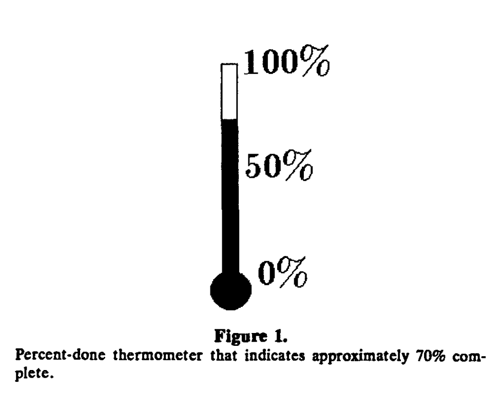
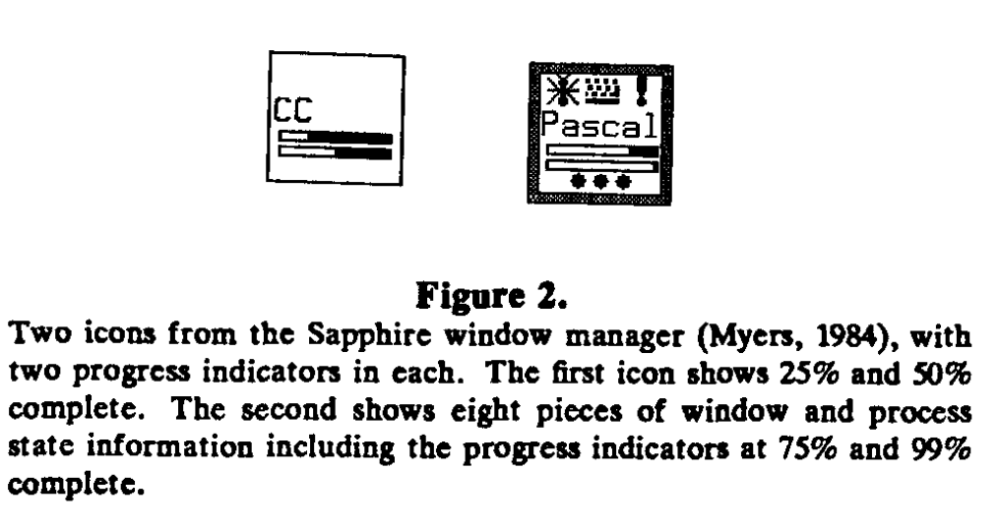
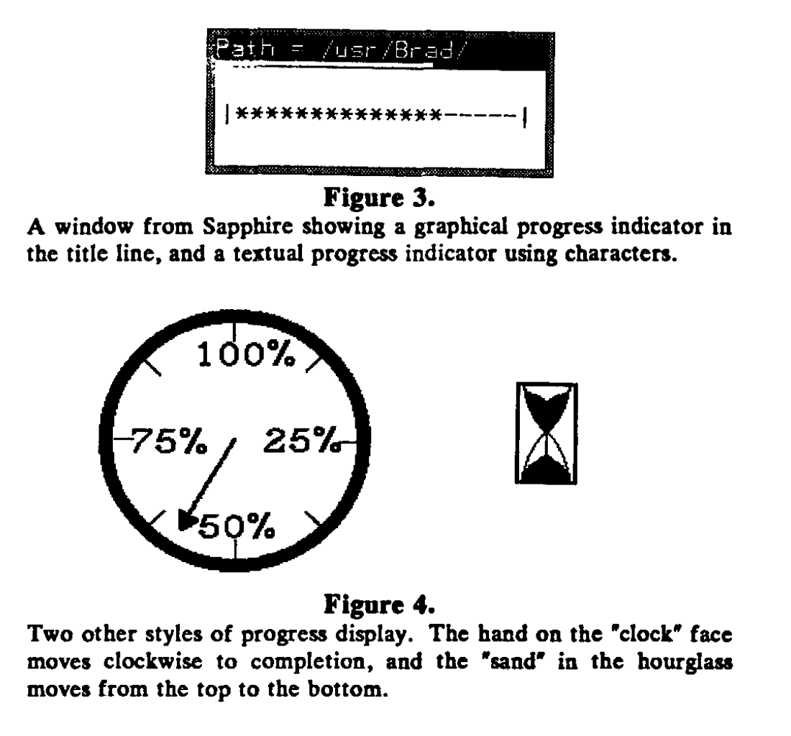
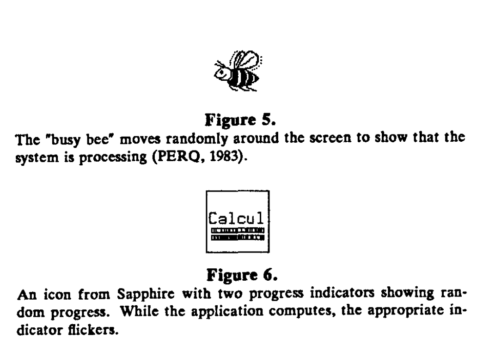

# The Importance of Percent-Done Progress Indicators for Computer-Human interfaces

[The importance of percent-done progress indicators for computer-human interfaces | Proceedings of the SIGCHI Conference on Human Factors in Computing Systems](https://dl.acm.org/doi/10.1145/317456.317459)

## 요약
'percent-done progress indicator(진행률 표시기)는 사용자가 작업 처리의 진행 상황을 모니터링할 수 있도록 하는 그래픽 기술입니다. 이 표시기는 거의 모든 종류의 출력 장치에 표시될 수 있으며, 다양한 프로그램에서 사용할 수 있습니다. 실무 경험과 공식 실험 결과, 진행률 표시기는 중요하고 유용한 사용자 인터페이스 도구이며, 이를 통합한 프로그램의 매력과 효율성을 높인다는 것이 입증되었습니다. **이 논문에서는 진행률 표시기가 왜 중요한지에 대해 논의합니다.** 여기에는 진행률 표시기와  관련된 공식 실험 결과가 포함됩니다.

한 실험에서는 사람들이 진행률 표시기를 선호하는 것을 보여줍니다. 또 다른 실험에서는 사람들이 일반적으로 일정한 응답 시간을 가변적인 응답 시간보다 선호한다는 이전 연구 결과를 복제하려 했으며, 진행률 표시기가 있을 경우 이 효과가 반전될 수 있는지를 보여주려 했으나, 통계적으로 유의미한 결과를 얻지 못했습니다. 실제로, 이전에 발표된 결과와 달리 일정한 응답 시간을 선호한다는 명확한 증거는 발견되지 않았습니다.

> 사람들이 컴퓨터 프로그램을 사용할 때 응답 시간이 일정한 것을 가변적인 것보다 더 선호한다는 이전 연구 결과를 확인하려고 했다는 의미입니다. 그리고 진행률 표시기(예: 작업의 완료 비율을 보여주는 막대)가 있을 때, 사람들이 가변적인 응답 시간도 선호할 수 있는지를 알아보려고 했습니다.

## 1. Introduction
안타깝게도, 사용자에게 지연이 느껴지지 않을 정도로 즉각적으로 실행될 수 없는 컴퓨터 프로그램들이 항상 존재할 것입니다. 예를 들어, 컴파일러, 텍스트 포멧터, 플로피 디스켓이나 다른 느린 장치에서 파일을 로딩하는 작업, 원격 컴퓨터나 프린트로 파일을 전송하는 작업, 그리고 데이터베이스 처리등이 있습니다. 메뉴, 아이콘 등 '사용하기 쉬운' 인터페이스를 가진 인터랙티브 컴퓨터 시스템이라고 하더라도, 사용자는 여전히 컴퓨터가 요청을 처리하는 중에 완료되지 않은 상태에서 기다려야 하는 경우를 마주하게 됩니다.

> 1985년도 논문이니까 현재 운영체제 같은 GUI가 아니라 DOS를 이야기하는 것 같습니다. 

진행률 표시기는 긴 작업의 완료 정도를 그래픽으로 보여주는 기법입니다. 자선 모금 행사에서 사용하는 거대한 온도계처럼 작동하며, 작업이 진행됨에 따라 '빈 상태'에서 '가득 찬 상태'로 채워집니다. (그림 1 참조.)

진행률 표시기는 사용자가 작업이 얼마나 완료되었는지와 언제 완료될 것인지에 대한 정보를 빠르게 파악할 수 있게 해줍니다. 많은 시스템은 현재 "바쁨"을 나타내는 이미지(예: 모래시계, 시계, 부처님)(인내를 나타내기 위한)를 보여주지만, 이것은 정적이기 때문에 프로그램이 얼마나 빨리 진행되고 있는지 또는 프로그램이 중단되었는지를 알 수 없습니다.

일부 시스템(UNIX, Accent)은 멀티 프로세싱을 지원하므로 컴퓨터가 동시에 여러 작업을 수행할 수 있습니다. 멀티 프로세싱이 BLIT(Pike, 1983)이나 PERQ(Myers, 1984)와 같은 윈도우 관리 시스템과 결합될 때, 사용자는 여러 작업을 동시에 실행하도록 권장됩니다. 예를 들어, 사용자가 한 파일을 편집하는 동안 시스템이 다른 파일을 백그라운드에서 컴파일할 수 있습니다. 이 경우, 진행률 표시기를 사용하여 각 프로세스의 진행 상황을 보여주고 사용자에게 전체 환경의 상태를 알려줄 수 있습니다.

`BLIT: BLIT은 “Bell Labs Intelligent Terminal”의 약자입니다. 이는 1980년대 초에 벨 연구소(Bell Labs)에서 개발한 그래픽 터미널로, 당시 매우 혁신적인 기술로 평가받았습니다. BLIT는 비트맵 그래픽스를 지원했으며, 멀티태스킹과 윈도우 관리 기능을 제공하여 사용자가 동시에 여러 프로그램을 실행할 수 있도록 했습니다. BLIT은 기본적으로 고해상도 디스플레이를 갖춘 그래픽 터미널로 설계되었으며, Unix 기반 시스템과 함께 사용되었습니다.`

`PERQ: PERQ는 1980년대 초반에 나왔던 최초의 상업용 개인 워크스테이션 중 하나로, PERQ Systems Corporation에서 제조했습니다. PERQ는 고성능 그래픽 기능을 갖춘 컴퓨터로, 연구 및 공학 계산, 컴퓨터 그래픽스 응용 프로그램에서 많이 사용되었습니다. 또한 Unix와 같은 멀티태스킹 운영체제를 실행할 수 있었고, 사용자에게 동시에 여러 작업을 수행할 수 있는 기능을 제공했습니다. PERQ는 또한 고해상도 비트맵 디스플레이와 마우스 인터페이스를 갖추고 있어 당시로서는 매우 발전된 그래픽 인터페이스를 제공했습니다.`

진행률 표시기를 구현하는 일반적인 방식은 애플리케이션 프로그램이 이를 명시적으로 업데이트하도록 요구합니다. 이는 프로그램이 충돌(crash)할 경우, 진행률 표시기의 업데이트도 중단된다는 것을 의미합니다. 따라서, 진행률 표시기는 프로그램이 여전히 실행 중인지 여부를 사용자에게 알려주는 역할도 합니다.

진행률 표시기는 보통 숫자로 된 백분율 대신 그래픽으로 표시됩니다. 이는 여러 가지 장점이 있습니다. 첫째, 사용자가 정확한 값을 필요로 하지 않을 때, 텍스트보다 그래픽 표시를 더 빠르고 쉽게 이해할 수 있습니다.(Myers, 1983) 둘째, 그래픽 표시를 사용하면 정확한 시간을 거의 측정할 수 없기 때문에 대략적인 시간만을 제공할 수 있음을 암시합니다. 마지막으로, 그래픽 이미지는(그림 2와 같이) 화면의 다른 표시를 방해하지 않으면서 작은 공간에 표시될 수 있습니다.

## 2. Implementing Progress Indicators(진행률 표시기의 구현)
진행률 표시기는 사용되는 디스플레이 장치에 따라 다양한 형식으로 표시될 수 있지만, 모든 경우에 전체 작업 중 몇 퍼센트가 완료되었는지를 나타내는 표시가 있어야 합니다. 예를 들어, 문자 기반 터미널에서는 화면 하단에 별표 `(*)` 가 연속적으로 나타나며, 오른쪽 끝에 도달하면 완료를 나타낼 수 있습니다.(그림 3 참조) 개인용 워크스테이션에서 사용하는 비트맵 디스플레이에서는, 진행률 표시기가 점점 커지는 막대(그림 3 참조), 채워지는 모래 시계, 시계의 바늘이 움직이는 모습(그림 4 참조) 등으로 표시될 수 있습니다.

실제로 이러한 그림을 표시하는 중앙화된 루틴이 있어야 하며, 모든 프로그램에 대해 일관된 진행률을 보여주도록 해야합니다. 추가적으로 보조 루틴이 있을 수 있는데, 예를 들어 파일 변수(UNIX 또는 PASCAL에서와 같이)를 받아 파일이 읽힌 퍼센트를 보여주는 것이 있습니다.

> 중앙화된 루틴(centralized routine)은 특정 기능이나 작업을 수행하는 코드 블록 또는 함수가 프로그램의 여러 부분에서 일관되게 호출될 수 있도록 한 중앙 위치에 정의된 것을 의미합니다.
> 
> 이 문맥에서 “중앙화된 루틴”은 **진행률 표시기를 그리는 작업을 담당하는 하나의 함수 또는 모듈**을 가리킵니다. 즉, 모든 프로그램이 동일한 방식으로 진행률 표시기를 업데이트하고 표시할 수 있도록 하는 코드가 한 곳에 모여 있다는 뜻입니다. 이렇게 하면 각기 다른 프로그램이나 프로세스가 개별적으로 진행률 표시기를 구현할 필요 없이, 공통의 “중앙화된 루틴”을 호출하여 동일한 방식으로 진행률을 표시할 수 있습니다.
> 
> 중앙화된 루틴을 사용하면 코드의 **재사용성**과 **유지 관리 용이성**이 높아집니다. 예를 들어, 진행률 표시기의 모양이나 동작을 변경하려면 각 프로그램에서 코드를 수정할 필요 없이, 해당 중앙화된 루틴을 한 번 수정하면 됩니다.

진행률 표시기가 어떻게 표시되든, 프로그램은 표시기에 대한 퍼센트 정보를 계산할 수 있어야 합니다. 이는 입력을 선형적으로 처리하고 완료되는 알고리즘에서 가장 쉽습니다. 다행히도 상당히 많은 작업이 이 범주에 속합니다. 예로는 파일 전송, 프로그램 로딩, 컴파일, 텍스트 처리 등이 있습니다. 이러한 작업들은 많은 시스템에서 실행되는 긴 프로그램의 상당 부분을 차지합니다. 그러나, 이러한 모든 작업에는 비선형적인 부분도 있을 수 있습니다. 예를 들어, 컴파일할 프로그램은 다른 프로그램(임포트 되거나 포함된 파일과 같은)을 참조할 수 있으며, 이들 또한 처리해야 합니다. 또한, UNIX의 '파이프' 메커니즘에서는 입력이 다른 프로그램에서 올 수 있기 때문에 입력의 길이를 알기 어렵습니다. 이러한 문제는 파이프라인에 있는 모든 프로그램이 거의 같은 속도로 입력을 처리하고, 원래의 데이터 생성자(파일 또는 데이터를 생성하는 프로그램)를 기준으로 진행률을 나타내도록 함으로써 해결할 수 있습니다.
  
`UNIX "파이프" 메커니즘: 파이프(pipe)는 UNIX와 같은 운영 체제에서 두 개 이상의 프로그램 간에 데이터를 전달하는 메커니즘입니다. 파이프를 사용하면 한 프로그램의 출력이 다른 프로그램의 입력으로 연결됩니다. 예를 들어, program1 | program2와 같은 명령을 사용하면, program1의 출력이 program2의 입력으로 전달됩니다. 이 방법은 데이터를 프로그램 간에 실시간으로 전송하고 처리할 수 있게 해줍니다.`

> 현대 프로그래밍에서는 기본적인 개념은 유효하지만 더 정교하고 효율적인 방식으로 처리한다. 예를 들어 스트리밍과 비동기 처리를 위해 Node.js는 스트림 API를 이용해 데이터를 chunk 단위로 전달하고 진행률을 업데이트 할 수 있다.

데이터를 여러 번 통과하는 프로그램에서는 각 통과 단계에 대해 진행률 표시기를 구분하여 나타낼 수 있습니다. 어차피 진행률은 대략적인 것이므로, 프로그램은 경험이나 휴리스틱을 기반으로 얼마나 오래 실행될지 추정할 수 있습니다. 또한, 시스템이 명령 파일이나 스크립트를 통해 프로그램의 계층 구조를 지원하는 경우, 동일한 프로세스에 대해 여러개의 진행률 표시기를 제공하는 것이 유용할 수 있습니다. 예를 들어, Sapphire 윈도우 관리자에는 아이콘에 두 개의 진행률 표시기가 있으며, 하나는 현재 프로그램용이고 다른 하나는 전체 작업용입니다.(그림 2 참조)

> [휴리스틱 평가는 어떤 의미일까?](https://brunch.co.kr/@dhlee702/28)

단순히 실행 시간이 얼마나 걸릴지 계산할 수 없는 프로그램의 경우, 시스템은 임의의 진행률을 제공할 수 있습니다. 이는 여러 가지 방법으로 표시될 수 있는데, 예를 들어 점을 단순히 찍어내거나, 화면에서 "바쁜 벌(busy bee)"이 움직이는 모습을 보여주거나(그림 5 참조), 끊임없이 변화하는 패턴을 표시하는 것(그림 6 참조) 등이 있습니다. 이러한 방법은 완료된 퍼센티지를 표시할 수 있는 정보가 없더라도, 시스템이 사용자의 요청을 처리 중이며 충돌(crash)하지 않았음을 사용자에게 알립니다. 그러나, 일부 프로그램에서는 완료된 퍼센티지를 표시하는 진행률 표시기를 사용하고, 일부 프로그램에서는 임의의 진행률만을 보여주는 것이, 아예 진행률 표시가 없는 것보다 사용자에게 더 짜증을 유발할지에 대한 의문이 있습니다. POS(PERQ, 1983)와 관련된 경험에 따르면, 그렇지 않다고 합니다.

진행률 표시기는 새로운 개념이 아닙니다. 예를 들어, Spence(1976)는 CAD-CAM 응용 프로그램에서 요청이 완료되기까지 남은 시간을 보여주기 위해 그래픽 카운트 다운 시계(그림 4)가 사용되었다고 보고했습니다. 또한 애플 매킨토시의 Macterminal 프로그램에서는 파일 전송 시에도 사용되었습니다.(Wiliiams, 1984) **그러나 어떤 이유에서인지 진행률 표시기는 드물게 사용되었습니다. 사용자 인터페이스에 진행률 표시기를 철저히 통합한 PERQ POS(PERQ, 1983)와 Sapphire(Myers, 1984) 시스템과 관련된 경험에 따르면, 진행률 표시기는 다양한 응용 프로그램에서 매우 유용하다는 것이 입증되었습니다. 그러나 진행률 표시기는 알고리즘 설계와 실행 시간 측면에서 분명히 비용이 수반되므로, 실제로 사용자가 그것을 유용하다고 인식하는지 여부를 판단하는 것이 적절합니다.**

이 논문에서는 사람들이 실제로 진행률 표시기를 선호한다는 것을 보여주는 공식적인 실험 결과를 보고합니다.

## 3. The Experiment
### 3.1 Hypotheses
