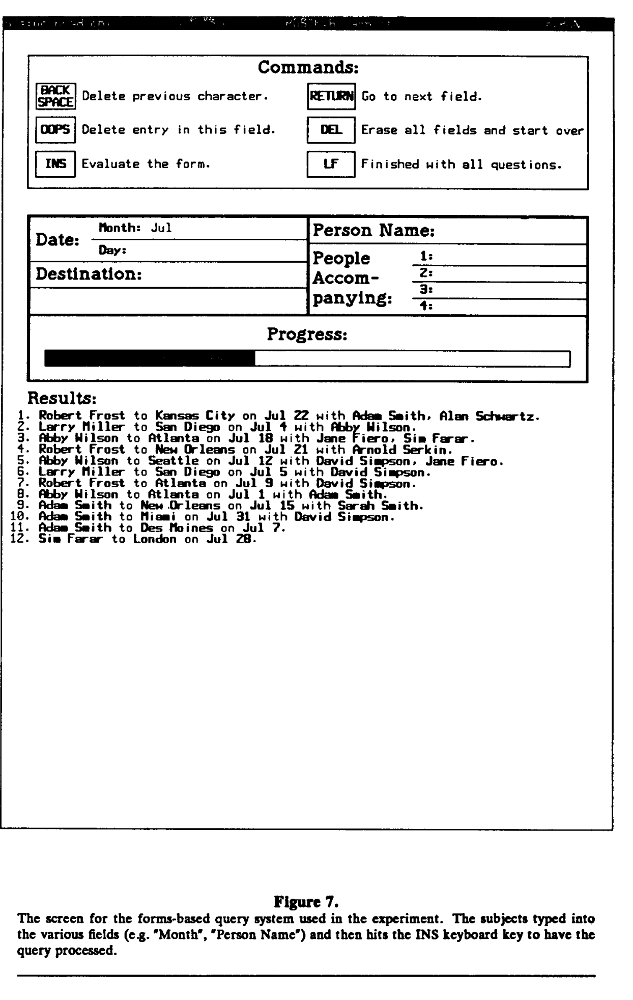
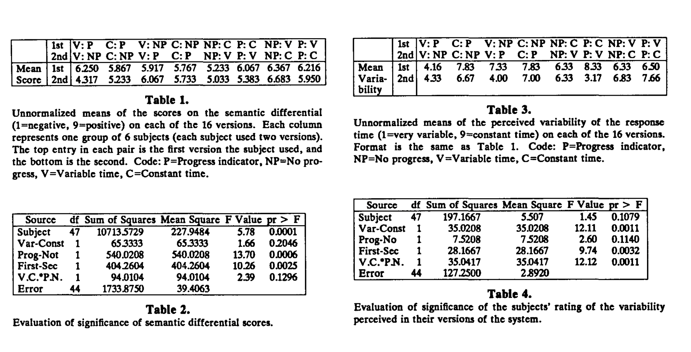

# The Importance of Percent-Done Progress Indicators for Computer-Human interfaces

[The importance of percent-done progress indicators for computer-human interfaces | Proceedings of the SIGCHI Conference on Human Factors in Computing Systems](https://dl.acm.org/doi/10.1145/317456.317459)

도허티 임계점에 대한 블로그 작성을 위해 참고한 논문입니다. 1985년에 발표된 논문으로, 컴퓨터 프로그램의 진행률 표시기가 사용자 인터페이스에 미치는 영향에 대해 논의합니다.

## 요약
'percent-done progress indicator(진행률 표시기)는 사용자가 작업 처리의 진행 상황을 모니터링할 수 있도록 하는 그래픽 기술입니다. 이 표시기는 거의 모든 종류의 출력 장치에 표시될 수 있으며, 다양한 프로그램에서 사용할 수 있습니다. 실무 경험과 공식 실험 결과, 진행률 표시기는 중요하고 유용한 사용자 인터페이스 도구이며, 이를 통합한 프로그램의 매력과 효율성을 높인다는 것이 입증되었습니다. **이 논문에서는 진행률 표시기가 왜 중요한지에 대해 논의합니다.** 여기에는 진행률 표시기와  관련된 공식 실험 결과가 포함됩니다.

한 실험에서는 사람들이 진행률 표시기를 선호하는 것을 보여줍니다. 또 다른 실험에서는 사람들이 일반적으로 일정한 응답 시간을 가변적인 응답 시간보다 선호한다는 이전 연구 결과를 복제하려 했으며, 진행률 표시기가 있을 경우 이 효과가 반전될 수 있는지를 보여주려 했으나, 통계적으로 유의미한 결과를 얻지 못했습니다. 실제로, 이전에 발표된 결과와 달리 일정한 응답 시간을 선호한다는 명확한 증거는 발견되지 않았습니다.

> 사람들이 컴퓨터 프로그램을 사용할 때 응답 시간이 일정한 것을 가변적인 것보다 더 선호한다는 이전 연구 결과를 확인하려고 했다는 의미입니다. 그리고 진행률 표시기(예: 작업의 완료 비율을 보여주는 막대)가 있을 때, 사람들이 가변적인 응답 시간도 선호할 수 있는지를 알아보려고 했습니다.

## 1. Introduction
안타깝게도, 사용자에게 지연이 느껴지지 않을 정도로 즉각적으로 실행될 수 없는 컴퓨터 프로그램들이 항상 존재할 것입니다. 예를 들어, 컴파일러, 텍스트 포멧터, 플로피 디스켓이나 다른 느린 장치에서 파일을 로딩하는 작업, 원격 컴퓨터나 프린트로 파일을 전송하는 작업, 그리고 데이터베이스 처리등이 있습니다. 메뉴, 아이콘 등 '사용하기 쉬운' 인터페이스를 가진 인터랙티브 컴퓨터 시스템이라고 하더라도, 사용자는 여전히 컴퓨터가 요청을 처리하는 중에 완료되지 않은 상태에서 기다려야 하는 경우를 마주하게 됩니다.

> 1985년도 논문이니까 현재 운영체제 같은 GUI가 아니라 DOS를 이야기하는 것 같습니다. 

진행률 표시기는 긴 작업의 완료 정도를 그래픽으로 보여주는 기법입니다. 자선 모금 행사에서 사용하는 거대한 온도계처럼 작동하며, 작업이 진행됨에 따라 '빈 상태'에서 '가득 찬 상태'로 채워집니다. (그림 1 참조.)

진행률 표시기는 사용자가 작업이 얼마나 완료되었는지와 언제 완료될 것인지에 대한 정보를 빠르게 파악할 수 있게 해줍니다. 많은 시스템은 현재 "바쁨"을 나타내는 이미지(예: 모래시계, 시계, 부처님)(인내를 나타내기 위한)를 보여주지만, 이것은 정적이기 때문에 프로그램이 얼마나 빨리 진행되고 있는지 또는 프로그램이 중단되었는지를 알 수 없습니다.

일부 시스템(UNIX, Accent)은 멀티 프로세싱을 지원하므로 컴퓨터가 동시에 여러 작업을 수행할 수 있습니다. 멀티 프로세싱이 BLIT(Pike, 1983)이나 PERQ(Myers, 1984)와 같은 윈도우 관리 시스템과 결합될 때, 사용자는 여러 작업을 동시에 실행하도록 권장됩니다. 예를 들어, 사용자가 한 파일을 편집하는 동안 시스템이 다른 파일을 백그라운드에서 컴파일할 수 있습니다. 이 경우, 진행률 표시기를 사용하여 각 프로세스의 진행 상황을 보여주고 사용자에게 전체 환경의 상태를 알려줄 수 있습니다.

`BLIT: BLIT은 “Bell Labs Intelligent Terminal”의 약자입니다. 이는 1980년대 초에 벨 연구소(Bell Labs)에서 개발한 그래픽 터미널로, 당시 매우 혁신적인 기술로 평가받았습니다. BLIT는 비트맵 그래픽스를 지원했으며, 멀티태스킹과 윈도우 관리 기능을 제공하여 사용자가 동시에 여러 프로그램을 실행할 수 있도록 했습니다. BLIT은 기본적으로 고해상도 디스플레이를 갖춘 그래픽 터미널로 설계되었으며, Unix 기반 시스템과 함께 사용되었습니다.`

`PERQ: PERQ는 1980년대 초반에 나왔던 최초의 상업용 개인 워크스테이션 중 하나로, PERQ Systems Corporation에서 제조했습니다. PERQ는 고성능 그래픽 기능을 갖춘 컴퓨터로, 연구 및 공학 계산, 컴퓨터 그래픽스 응용 프로그램에서 많이 사용되었습니다. 또한 Unix와 같은 멀티태스킹 운영체제를 실행할 수 있었고, 사용자에게 동시에 여러 작업을 수행할 수 있는 기능을 제공했습니다. PERQ는 또한 고해상도 비트맵 디스플레이와 마우스 인터페이스를 갖추고 있어 당시로서는 매우 발전된 그래픽 인터페이스를 제공했습니다.`

진행률 표시기를 구현하는 일반적인 방식은 애플리케이션 프로그램이 이를 명시적으로 업데이트하도록 요구합니다. 이는 프로그램이 충돌(crash)할 경우, 진행률 표시기의 업데이트도 중단된다는 것을 의미합니다. 따라서, 진행률 표시기는 프로그램이 여전히 실행 중인지 여부를 사용자에게 알려주는 역할도 합니다.

진행률 표시기는 보통 숫자로 된 백분율 대신 그래픽으로 표시됩니다. 이는 여러 가지 장점이 있습니다. 첫째, 사용자가 정확한 값을 필요로 하지 않을 때, 텍스트보다 그래픽 표시를 더 빠르고 쉽게 이해할 수 있습니다.(Myers, 1983) 둘째, 그래픽 표시를 사용하면 정확한 시간을 거의 측정할 수 없기 때문에 대략적인 시간만을 제공할 수 있음을 암시합니다. 마지막으로, 그래픽 이미지는(그림 2와 같이) 화면의 다른 표시를 방해하지 않으면서 작은 공간에 표시될 수 있습니다.

## 2. Implementing Progress Indicators(진행률 표시기의 구현)
진행률 표시기는 사용되는 디스플레이 장치에 따라 다양한 형식으로 표시될 수 있지만, 모든 경우에 전체 작업 중 몇 퍼센트가 완료되었는지를 나타내는 표시가 있어야 합니다. 예를 들어, 문자 기반 터미널에서는 화면 하단에 별표 `(*)` 가 연속적으로 나타나며, 오른쪽 끝에 도달하면 완료를 나타낼 수 있습니다.(그림 3 참조) 개인용 워크스테이션에서 사용하는 비트맵 디스플레이에서는, 진행률 표시기가 점점 커지는 막대(그림 3 참조), 채워지는 모래 시계, 시계의 바늘이 움직이는 모습(그림 4 참조) 등으로 표시될 수 있습니다.

실제로 이러한 그림을 표시하는 중앙화된 루틴이 있어야 하며, 모든 프로그램에 대해 일관된 진행률을 보여주도록 해야합니다. 추가적으로 보조 루틴이 있을 수 있는데, 예를 들어 파일 변수(UNIX 또는 PASCAL에서와 같이)를 받아 파일이 읽힌 퍼센트를 보여주는 것이 있습니다.

> 중앙화된 루틴(centralized routine)은 특정 기능이나 작업을 수행하는 코드 블록 또는 함수가 프로그램의 여러 부분에서 일관되게 호출될 수 있도록 한 중앙 위치에 정의된 것을 의미합니다.
> 
> 이 문맥에서 “중앙화된 루틴”은 **진행률 표시기를 그리는 작업을 담당하는 하나의 함수 또는 모듈**을 가리킵니다. 즉, 모든 프로그램이 동일한 방식으로 진행률 표시기를 업데이트하고 표시할 수 있도록 하는 코드가 한 곳에 모여 있다는 뜻입니다. 이렇게 하면 각기 다른 프로그램이나 프로세스가 개별적으로 진행률 표시기를 구현할 필요 없이, 공통의 “중앙화된 루틴”을 호출하여 동일한 방식으로 진행률을 표시할 수 있습니다.
> 
> 중앙화된 루틴을 사용하면 코드의 **재사용성**과 **유지 관리 용이성**이 높아집니다. 예를 들어, 진행률 표시기의 모양이나 동작을 변경하려면 각 프로그램에서 코드를 수정할 필요 없이, 해당 중앙화된 루틴을 한 번 수정하면 됩니다.

진행률 표시기가 어떻게 표시되든, 프로그램은 표시기에 대한 퍼센트 정보를 계산할 수 있어야 합니다. 이는 입력을 선형적으로 처리하고 완료되는 알고리즘에서 가장 쉽습니다. 다행히도 상당히 많은 작업이 이 범주에 속합니다. 예로는 파일 전송, 프로그램 로딩, 컴파일, 텍스트 처리 등이 있습니다. 이러한 작업들은 많은 시스템에서 실행되는 긴 프로그램의 상당 부분을 차지합니다. 그러나, 이러한 모든 작업에는 비선형적인 부분도 있을 수 있습니다. 예를 들어, 컴파일할 프로그램은 다른 프로그램(임포트 되거나 포함된 파일과 같은)을 참조할 수 있으며, 이들 또한 처리해야 합니다. 또한, UNIX의 '파이프' 메커니즘에서는 입력이 다른 프로그램에서 올 수 있기 때문에 입력의 길이를 알기 어렵습니다. 이러한 문제는 파이프라인에 있는 모든 프로그램이 거의 같은 속도로 입력을 처리하고, 원래의 데이터 생성자(파일 또는 데이터를 생성하는 프로그램)를 기준으로 진행률을 나타내도록 함으로써 해결할 수 있습니다.
  
`UNIX "파이프" 메커니즘: 파이프(pipe)는 UNIX와 같은 운영 체제에서 두 개 이상의 프로그램 간에 데이터를 전달하는 메커니즘입니다. 파이프를 사용하면 한 프로그램의 출력이 다른 프로그램의 입력으로 연결됩니다. 예를 들어, program1 | program2와 같은 명령을 사용하면, program1의 출력이 program2의 입력으로 전달됩니다. 이 방법은 데이터를 프로그램 간에 실시간으로 전송하고 처리할 수 있게 해줍니다.`

> 현대 프로그래밍에서는 기본적인 개념은 유효하지만 더 정교하고 효율적인 방식으로 처리한다. 예를 들어 스트리밍과 비동기 처리를 위해 Node.js는 스트림 API를 이용해 데이터를 chunk 단위로 전달하고 진행률을 업데이트 할 수 있다.

데이터를 여러 번 통과하는 프로그램에서는 각 통과 단계에 대해 진행률 표시기를 구분하여 나타낼 수 있습니다. 어차피 진행률은 대략적인 것이므로, 프로그램은 경험이나 휴리스틱을 기반으로 얼마나 오래 실행될지 추정할 수 있습니다. 또한, 시스템이 명령 파일이나 스크립트를 통해 프로그램의 계층 구조를 지원하는 경우, 동일한 프로세스에 대해 여러개의 진행률 표시기를 제공하는 것이 유용할 수 있습니다. 예를 들어, Sapphire 윈도우 관리자에는 아이콘에 두 개의 진행률 표시기가 있으며, 하나는 현재 프로그램용이고 다른 하나는 전체 작업용입니다.(그림 2 참조)

> [휴리스틱 평가는 어떤 의미일까?](https://brunch.co.kr/@dhlee702/28)

단순히 실행 시간이 얼마나 걸릴지 계산할 수 없는 프로그램의 경우, 시스템은 임의의 진행률을 제공할 수 있습니다. 이는 여러 가지 방법으로 표시될 수 있는데, 예를 들어 점을 단순히 찍어내거나, 화면에서 "바쁜 벌(busy bee)"이 움직이는 모습을 보여주거나(그림 5 참조), 끊임없이 변화하는 패턴을 표시하는 것(그림 6 참조) 등이 있습니다. 이러한 방법은 완료된 퍼센티지를 표시할 수 있는 정보가 없더라도, 시스템이 사용자의 요청을 처리 중이며 충돌(crash)하지 않았음을 사용자에게 알립니다. 그러나, 일부 프로그램에서는 완료된 퍼센티지를 표시하는 진행률 표시기를 사용하고, 일부 프로그램에서는 임의의 진행률만을 보여주는 것이, 아예 진행률 표시가 없는 것보다 사용자에게 더 짜증을 유발할지에 대한 의문이 있습니다. POS(PERQ, 1983)와 관련된 경험에 따르면, 그렇지 않다고 합니다.

진행률 표시기는 새로운 개념이 아닙니다. 예를 들어, Spence(1976)는 CAD-CAM 응용 프로그램에서 요청이 완료되기까지 남은 시간을 보여주기 위해 그래픽 카운트 다운 시계(그림 4)가 사용되었다고 보고했습니다. 또한 애플 매킨토시의 Macterminal 프로그램에서는 파일 전송 시에도 사용되었습니다.(Wiliiams, 1984) **그러나 어떤 이유에서인지 진행률 표시기는 드물게 사용되었습니다. 사용자 인터페이스에 진행률 표시기를 철저히 통합한 PERQ POS(PERQ, 1983)와 Sapphire(Myers, 1984) 시스템과 관련된 경험에 따르면, 진행률 표시기는 다양한 응용 프로그램에서 매우 유용하다는 것이 입증되었습니다. 그러나 진행률 표시기는 알고리즘 설계와 실행 시간 측면에서 분명히 비용이 수반되므로, 실제로 사용자가 그것을 유용하다고 인식하는지 여부를 판단하는 것이 적절합니다.**

이 논문에서는 사람들이 실제로 진행률 표시기를 선호한다는 것을 보여주는 공식적인 실험 결과를 보고합니다.

## 3. The Experiment
### 3.1 Hypotheses
이 실험은 세 가지 가설을 검증하기 위해 설계되었습니다. 

**첫 번째 가설은 사람들이 진행률 표시기가 있는 시스템을 선호한다는 것입니다.**

**두 번째 가설은 시스템의 응답 시간이 일정할 때보다 변동이 있을 때, 진행률 표시기가 더 유용하다는 것입니다.** 이전의 실험들, 예를 들어 Miller(1977)와 실무 경험(Carbonelle, 1968 및 Weisberg, 1984)에서는 사용자가 변동이 있는 경우 평균 시간이 짧더라도 예측 가능한 일정한 응답 시간을 선호한다는 것을 보여주었습니다.

**세 번째 가설은 진행률 표시기를 사용하면 이러한 효과가 반전될 수 있다는 것입니다.**

### 3.2 Method(방법)
이 실험을 위해 약 100개의 여행 항목을 포함하는 데이터베이스에서 간단한 패턴 매칭을 수행하는 간소화되고 컴퓨터화된 교통 관리 시스템을 준비했습니다. 이 과제는 Miller(1977)의 실험과 유사했습니다.

피험자들은 먼저 작업과 사용할 수 있는 명령어를 설명하는 지침서를 읽고, 컴퓨터 시스템을 사용하여 여덟 가지 질문(부록 A 참조)에 답변했습니다. 이 과정에는 데이터베이스에 약 14번의 질의가 필요했습니다. 질문은 종이에 인쇄되어 있었고, 답변은 별도의 답안지에 적었습니다. 컴퓨터 시스템은 PERQ 개인 워크스테이션에서 실행되었으며, 사용하기 쉽게 설계되었습니다. 질의를 하려면 피험자는 화면에 있는 양식을 작성한 다음(그림 7 참조), 키를 눌러 시스템이 이를 데이터베이스와 대조하도록 해야했습니다. 그러나 결과가 출력되기 전에 지연이 있었으며, 이는 일정한 10초 또는 1초에서 17초 사이에서 균등 분포로 무작위로 변동되었고, 평균 지연 시간은 8.601초 였습니다.

이 지연 시간 동안 진행률 표시기가 표시될 수 있었습니다. 모든 질의를 완료한 후, 피험자들은 시스템에 대한 그들의 느낌을 평가하기 위해 설문지를 작성했습니다. 이 설문지는 피험자가 시스템에 대한 태도를 측정하려는 "의미 차별적" 척도를 특징으로 했습니다. 예를 들어 "불안, 편안" 또는 "지루함, 흥분됨" 같은 항목이 포함되어 있으며, 각 항목은 1(부정적)에서 9(긍정적)까지의 범위를 가집니다.(부록 B 참조) 그 목적은 사용자의 느낌의 다양한 측면을 측정하는 것이었습니다. 각 항목은 직관적으로 선택되었습니다. 피험자는 그런 다음 다른 버전의 시스템으로 이 과정을 반복했습니다. 피험자들은 아래와 같이 사용한 버전을 결정하기 위해 네 그룹으로 나뉘었습니다.

1. **Constant time(일정 시간)**: First "Progress" then "No Progress"
2. **Variable time(변동 시간)**: First "Progress" then "No Progress"
3. **No Progress(진행 없음)**: First "Constant time" then "Variable"
4. **Progress(진행 있음)**: First "Constant time" then "Variable"

각 그룹은 절반은 한 버전을 먼저 사용하고, 나머지 절반은 그 버전을 두 번째로 사용하도록 추가로 나누어졌습니다. 시스템은 각 그룹에 같은 수의 사람들이 있도록 무작위로 피험자들을 배치했습니다.

두 번째 세트의 질문에 답한 후, 피험자들은 이전과 동일한 설문지를 작성하여 두 번째 버전에 대한 의견을 평가했습니다. 마지막으로, 피험자들은 두 시스템을 명시적으로 비교하는 질문과 일부 배경 정보를 묻는 질문이 포함된 다른 설문지를 작성했습니다. 모든 피험자는 같은 세션에서 두 버전과 모든 설문지를 완료했으며, 평균 시간은 지침서 읽기 5분, 각 버전에 10분, 각 설문지에 5분으로, 피험자당 총 40분이 소요되었습니다.

`Table 1: 각 16가지 버전에 대한 의미 차별 척도 점수의 비정규화된 평균값. 1=부정적, 9=긍정적, P=Progress indicator, NP=No Progress, V=Variable time, C=Constant time`

| Source    | df  | Sum of Squares | Mean Square | F Value | pr > F |
| --------- | --- | -------------- | ----------- | ------- | ------ |
| Subject   | 47  | 10713.5729     | 227.9484    | 5.78    | 0.0001 |
| Var-Cost  | 1   | 65.3333        | 65.3333     | 1.66    | 0.2046 |
| Prog-Not  | 1   | 540.0208       | 540.0208    | 13.70   | 0.0006 |
| First-Sec | 1   | 404.2604       | 404.2604    | 10.26   | 0.0025 |
| V.C P.N.  | 1   | 94.0104        | 94.0104     | 2.39    | 0.1296 |
| Error     | 44  | 1733.8750      | 39.4063     |         |        |

### 3.3 Population(모집단)
총 48명의 피험자가 실험에 참여했으며, 대부분은 컴퓨터 과학 대학원생이었지만, 약 5분의 1은 컴퓨터 초보자였습니다. 모든 피험자는 자발적인 무급 지원자였습니다.

### 3.4 Results
피험자들은 시스템을 배우고 사용하는 데 전혀 어려움을 겪지 않았습니다. 모든 버전이 사용하기 쉬운 것으로 평가되었으며, 피험자들의 긍정적인 의견과 오류가 적었다는 사실에 기반했습니다.

표 1은 서로 다른 버전에 따른 의미 차별 척도(semantic differential) 점수의 평균을 제공합니다. 이러한 데이터는 SAS 통계 프로그램(SAS, 1984)에 입력되었으며, 이는 표2의 데이터를 생성했습니다. 표 2는 진행률 표시기가 있는 경우와 없는 경우의 차이가 매우 유의미함을 보여줍니다.(pr = 0.0006) 또한 비교 설문지의 결과에 따르면, 피험자의 86.1%가 진행률 표시기를 좋아했으며, 평균 평점은 2.94로 1은 "매우 유용함"을, 9는 "쓸모없음, 짜증남"을 의미합니다. 다른 유의미한 결과로는 피험자들 간에 상당한 차이가 있었고, 첫 번째로 사용한 버전이 두 번째로 사용한 버전보다 더 높게 평가되었다는 점입니다.

흥미로운 결과는 일정한 응답 시간을 갖는 버전과 변동 응답 시간을 갖는 버전에 대한 통계적으로 유의미한 선호도가 없다는 것입니다.(pr = 0.2046) 진행률 표시기가 없는 버전만 고려해도 결과는 여전히 유의미하지 않습니다.(pr = 0.1497) 그림 8은 진행률 표시기가 있는 경우와 없는 경우에 대해 변동 시간과 일정한 시간의 평균 점수를 보여줍니다.

표 3과 4는 피험자들이 각 버전의 응답 시간 변동성을 평가한 결과를 보여줍니다. 여기서 유의미한 결과는 진행률 표시기가 있는 경우와 그렇지 않은 경우를 올바르게 평가한 변동성과의 높은 상관관계가 있다는 점입니다.

> 여기서 pr은 p-value(유의 확률을 의미한다) 검정 통계량이 귀무 가설이 참 일때(효과가 없다. 차이가 없다) 관찰된 값 이상으로 극단적인 값을 가질 확률을 나타낸다. 예를 들어, p-value가 0.05라면, 이는 귀무 가설이 참이라고 가정할 때, 현재의 결과가 무작위로 나타날 확률이 5%임을 의미한다.

> p-value는 단독으로 사용되지 않는데, p-value 자체만으로는 "이 값이 통계적으로 유의미한지"를판단할 기준이 없기 때문에, 유의 수준(a)라는 기준점과 비교가 필요하다.

> 유의 수준은 연구자가 사전에 정한 값으로, 귀무 가설을 기각할지 말지를 결정하는 기준이다.

> "pr > F"는 F-통계량과 관련된 **p-value를 의미한다.** pr > F = 0.0006이면 귀무 가설이 참일 때 F-검정 통계량이 관찰된 값보다 더 큰 값이 나타날 확률이 0.06%라는 의미이다. 이는 매우 낮은 확률이므로 귀무 가설을 기각하고, 결과가 통계적으로 유의미하다고 판단한다.

> F-통계량은 그룹 간 변동, 그룹 내 변동 2개의 분산(변동성)의 비율을 계산하여 도출된다. F-통계량을 사용하여 p-value를 구한다. 만약 p-value가 사전에 정한 유의 수준(a)보다 작다면, 귀무 가설을 기각하고, 그룹 간 평균에 통계적으로 유의미한 차이가 있다고 결론을 내린다.

> 일반적으로 유의 수준은 0.05(흔함), 0.01(엄격), 0.10(덜 엄격)으로 정한다.

### 3.5 Discussion of Experimental Results(실험 결과에 대한 논의)
**분명히, 이 실험은 사용자가 진행률 표시기를 선호한다는 가설을 강력히 지지합니다.** 이 결과는 통계적으로 유의미하며, **pr = 0.0006**에서 유의하다는 것은 이 효과가 무작위로 발생할 확률이 10,000번 중 6번에 불과하다는 의미입니다.

안타깝게도, 나머지 두 가지 가설, 즉 **"진행률 표시기가 응답 시간의 가변성에 대한 사용자들의 느낌에 영향을 미친다"는 가설과 "응답 시간의 가변성이 진행률 표시기에 대한 사용자들의 느낌에 영향을 미친다"는 가설은 지지되지 않았습니다.**

그러나 주목할 만한 점은, **피험자들은 진행률 표시기가 없을 때 일정한 시간(평균 = 5.73)을 가변 시간(평균 = 5.41)보다 더 선호했지만, 진행률 표시기가 있을 때는 가변 시간(평균 = 5.98)을 일정한 시간(평균 = 5.90)보다 더 선호했다는 것입니다(가설대로, 그림 8 참조).** 그러나 이 차이는 통계적으로 유의미하지 않았기 때문에, 이 실험은 Miller(1977)의 이전 실험 결과, 즉 적어도 진행률 표시기가 없는 경우에는 피험자들이 일정한 시간을 가변 시간보다 더 선호해야 한다는 결과를 재현하지 못했습니다.

피험자들이 실험을 수행하는 모습을 관찰한 결과, 진행률 표시기가 있을 때 피험자들은 화면에 다른 작업을 할 것이 없었기 때문에 진행률 표시기를 바라보는 경향이 있었습니다. 그러나 진행률 표시기가 없을 때는 피험자들이 화면에 지루함을 느끼고 주위를 둘러보거나 질문지나 지침서를 보는 경우가 많았습니다. 답이 화면에 나타날 때, 피험자들은 주변 시야에서 이를 알아차리고 다시 화면을 바라보았습니다. 이는 표 3과 4의 데이터로도 확인되는데, 이 표들은 진행률 표시기가 없을 때 피험자들이 일정 시간 버전과 가변 시간 버전을 동일하게 평가했지만, 진행률 표시기가 있을 때는 유의미한 차이가 나타났음을 보여줍니다(표 4의 V.C.와 P.N.의 상관관계, pr = 0.0011).

따라서, 이전 실험 결과의 일반적인 적용 가능성에 의문을 제기할 수 있습니다. 가변 시간이 항상 일정한 시간보다 더 나쁘게 인식되는 것은 아닙니다. 예를 들어, Miller의 실험에서는 문자가 표시되는 속도에 변동성이 있었는데, 이는 여기서 테스트된 상황과는 완전히 다른 상황입니다. 명백히, 변동성이 매우 낮으면 시스템은 일정하게 느껴질 것이고, 변동성이 매우 높다면(예: 1초에서 1시간까지) 평균 시간이 어떻든 간에 용납될 수 없을 것입니다. 진행률 표시기가 있을 때와 없을 때, 그리고 다양한 대기 조건에서 수용 가능한 변동성의 범위를 조사하는 실험은 흥미로울 것입니다. 또 다른 접근법은 피험자들이 화면에 더 많은 주의를 기울이도록 하는 것입니다. 예를 들어, 테스트에 시간 제한을 두고 답이 준비되었을 때 매우 희미한 신호를 제공하거나, 질문을 화면에 표시하여 피험자들이 종이를 볼 필요가 없도록 하는 것입니다.

또 다른 흥미로운 결과는 피험자들이 두 번째로 사용한 버전보다 첫 번째로 사용한 버전에 대해 더 낮은 평가를 내렸다는 것입니다(pr = 0.0025). 이는 사람들이 시스템에 지루해졌다는 것을 시사합니다(아마도 긴 응답 시간 때문일 것입니다) 그리고 시스템을 다시 사용해야 한다는 것에 짜증을 느꼈음을 보여줍니다. 그러나 실험에서는 이러한 영향을 통제하였으므로, 이는 정규화된 결과에 편향을 주지는 않습니다.

> • **첫 번째 사용 효과**: 처음 사용한 시스템에 대해 긍정적이거나 새롭다고 느껴 더 좋게 평가할 수 있습니다. 반면, 두 번째로 사용한 시스템은 이미 경험이 쌓인 후에 사용되었기 때문에, 처음의 신선함이나 호기심이 줄어들어 상대적으로 덜 긍정적으로 평가될 수 있습니다.
> 
> • **순서 효과(Order Effect)**: 실험에서 피험자들이 두 시스템을 사용한 순서가 평가에 영향을 미쳤을 수 있습니다. 예를 들어, 처음 사용한 시스템이 더 친숙하거나 이해하기 쉬웠다면, 피험자는 두 번째로 사용한 시스템과 비교하여 더 긍정적으로 평가했을 가능성이 있습니다. 순서 효과에는 초두 효과, 최신효과가 포함됩니다.
> 
> • **초두 효과(Primacy Effect)**: 첫 번째로 제시된 정보가 나중에 제시된 정보보다 더 강하게 기억되거나 더 긍정적으로 평가되는 경향이 있습니다. 이 연구에서 첫 번째로 사용한 시스템이 더 긍정적으로 평가된 것은 초두 효과 때문일 수 있습니다.
> 
> • **최신 효과(Recency Effect)**: 마지막으로 제시된 정보가 더 잘 기억되거나 더 강한 영향을 미치는 경향입니다. 이 경우에는 첫 번째 사용 시스템이 아닌 두 번째 시스템이 더 긍정적으로 평가되었을 때 적용될 수 있습니

## 4. Interpretation of Advantages of Progress Indicators(진행률 표시기의 장점에 대한 해석)
이 섹션에서는 사람들이 왜 진행률 표시기가 있는 버전을 선호하는지에 대한 몇 가지 설명을 제안하려고 합니다. 애플리케이션은 일반적으로 명령을 분석하고 이해한 후에야 진행률 표시기를 표시하기 때문에, 진행률 표시기는 [Miller(1968)가 나열한 다음과 같은 중요한 메시지](https://github.com/vertigo0538/research-papers/blob/main/response-time-in-man-computer-conversational-transactions%20/index.md#2-a-response-signal-can-communicate-several-messages-at-the-same-time)를 제공합니다.

사용자는
1. 자신의 요청이 수신되었고
2. 요청이 수락되었으며
3. 요청이 해석되었고
4. 시스템이 현재 그의 요청에 대한 답을 제공하기 위해 작업 중이라는 것을 알 수 있습니다.

progress bar는 특히 초보 사용자에게 중요합니다. 초보자는 컴퓨터의 모든 작업이 빠르게 진행되어야 한다고 생각하는 경향이 있기 때문에 (Foley, 1974) 컴퓨터가 작업하는 동안 피드백을 제공하지 않으면 컴퓨터가 멈췄다고 생각하거나 당황할 가능성이 더 큽니다. 전문가들은 일반적으로 대부분의 작업이 얼마나 오래 걸릴지에 대한 감각을 가지고 있지만, 그들 또한 진행률 표시기의 혜택을 받을 수 있습니다. 전문가들은 자신의 시간이 소중하기 때문에 여러 작업을 병렬로 실행할 가능성이 더 높지만, 대부분의 사람은 멀티프로세싱 중에 무슨 일이 일어나고 있는지 추적하는 것이 어렵습니다. 진행률 표시는 사용자가 여러 작업을 계획하고 모니터링하여 시간을 더 효과적으로 사용할 수 있도록 도와줍니다. 진행률 표시기의 효과를 멀티프로세싱 환경에 측정하려는 실험도 흥미로울 것입니다.

사람들이 진행률 표시기가 있는 시스템을 선호하는 또 다른 이유는 그들이 거의 가만히 앉아 시간을 낭비하는 것을 좋아하지 않기 때문일 수 있습니다. 따라서 모든 "대기" 시간은 짜증스럽습니다. 이 효과는 컴퓨터 외의 다른 영역에서도 많이 나타납니다. 예를 들어, 전화 통화 대기 중일 때와 같은 상황입니다. 사람들이 대기 시간이 얼마나 될지 모를 때, 적절한 길이의 다른 작업을 일정에 넣거나 효과적으로 휴식을 취하는 것이 불가능합니다. 이는 대기 중 긴장 수준을 높이는 경향이 있습니다. 그러나 진행 상황에 대한 표시가 있거나 사용자가 작업이 완료될 때까지의 시간을 미리 알게 되면, 그 시간은 생산적인 방식으로 활용될 수 있습니다. **사용자의 불안을 줄이는 것은 진행률 표시기의 중요한 이점입니다.** 따라서 진행률 표시기의 대안으로, 작업이 완료될 때까지 남은 시간을 실제 숫자나 아날로그 디스플레이로 표시하는 것도 하나의 방법이 될 수 있습니다.

## 5. Conclusion(결론)
완료된 비율을 보여주는 진행률 표시는 여러 측면에서 사용자에게 도움을 주는 중요한 사용자 인터페이스 도구인 것으로 보입니다. 초보 사용자에게는 명령이 받아들여졌고 작업이 성공적으로 진행되고 있음을 보여줌으로써 시스템에 대해 더 긍정적인 느낌으 가지도록 도와줍니다. 또한, 숙련된 사용자에게는 작업 완료 시간을 예측하고, 이를 통해 시간을 더 효과적으로 계획할 수 있는 충분한 정보를 제공하므로 유용합니다. 이는 특히 윈도우를 사용하는 멀티 프로세싱 시스템에서 중요합니다. 여기에서 제시된 실험적 증거는 진행률 표시기가 있는 시스템이 사용자들로부터 더 선호된다는 것을 보여줍니다. 이는 미래의 시스템에 이러한 표시기를 포함하는 데 필요한 추가적인 계산 및 구현 비용이 충분히 타당하는 것을 시사합니다.

