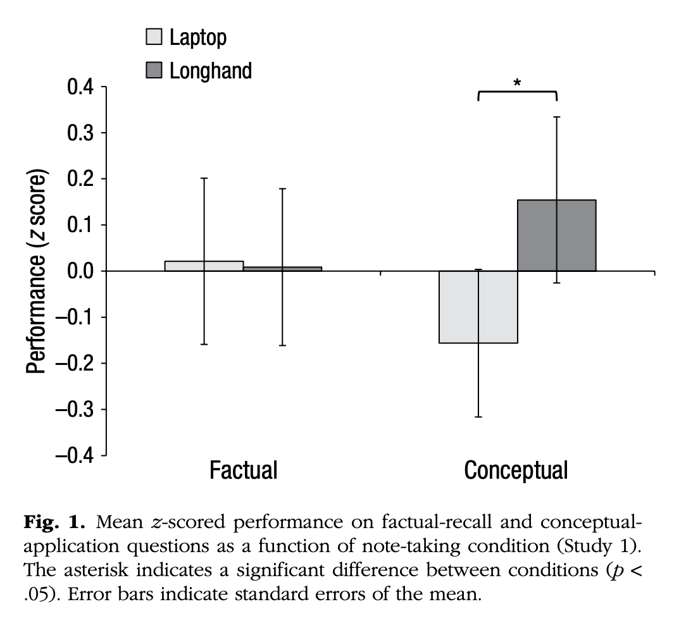
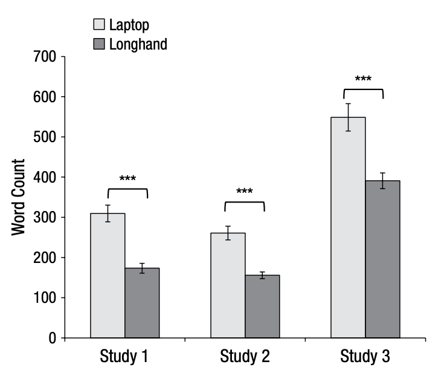
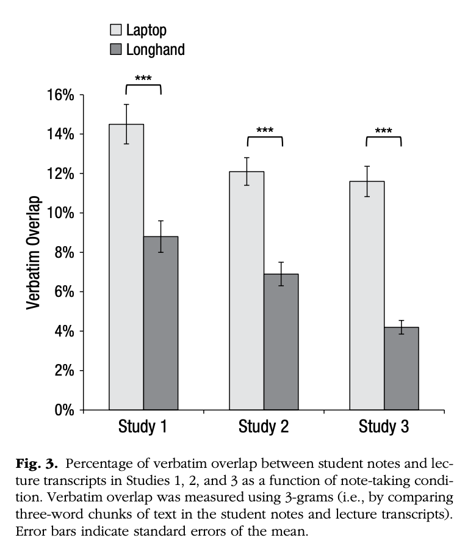
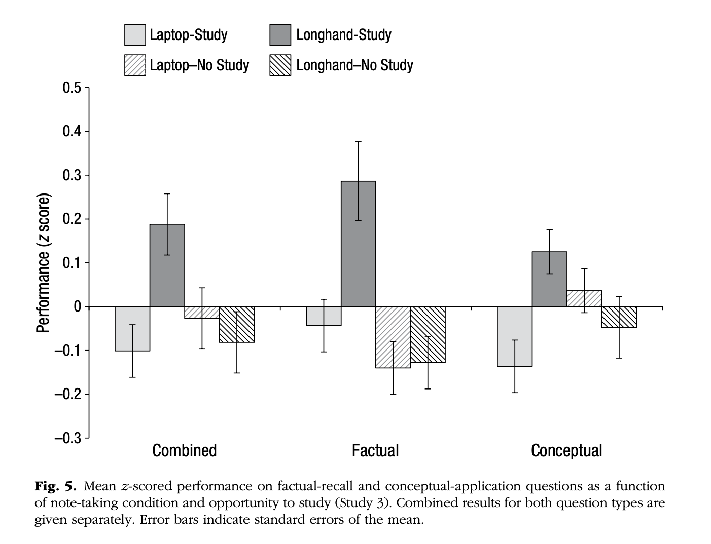
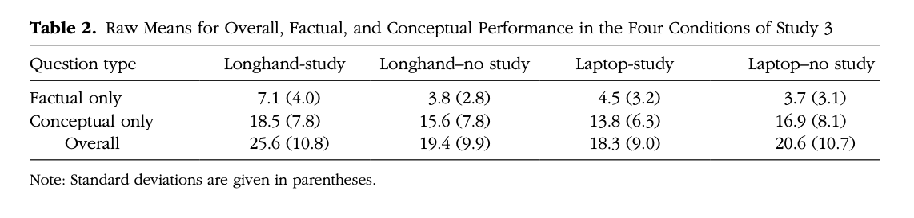

# The Pen Is Mightier Than the Keyboard: Advantages of Longhand Over Laptop Note Taking 

The Pen Is Mightier Than the Keyboard: Advantages of Longhand Over Laptop Note Taking - Pam A. Mueller1 and Daniel M. Oppenheimer

## Abstract
노트북으로 필기하는 것이 손으로 필기하는 것보다 점점 더 흔해지고 있다. 많은 연구자들이 노트북 필기가 학습 효과 면에서 손 필기보다 덜 효과적이라고 제안해왔다.

이전 연구들은 주로 노트북 사용 시 학생들이 멀티태스킹 및 주의 산만에 얼마나 영향을 받는지에 초점을 맞추었다. 본 연구는 노트북이 단순히 필기를 위한 용도로만 사용될 때조차도 학습에 부정적인 영향을 미칠 수 있음을 시사하는데, 그 이유는 노트북 사용이 얕은 정보 처리로 이어지기 때문이다.

세 가지 연구에서 우리는 노트북으로 필기한 학생들이 개념적 질문에서 손으로 필기한 학생들보다 성적이 더 낮음을 발견했다. 우리는 많은 필기가 유익할 수 있는 반면, 노트북 필기자들이 강의를 단순히 그대로 옮겨 적는 경향이 정보를 처리하고 자신의 말로 재구성하는 것을 방해하여 학습에 해롭다는 점을 보여준다.

## Keywords
academic achievement(학업 성취), cognitive processes(인지 과정), memory(기억), educational psychology(교육 심리학), open data(오픈 데이터), open materials(오픈 자료)

수업에서의 노트북 사용에 대해서는 논란이 있다. 많은 교수들은 컴퓨터(그리고 인터넷)가 방해 요소로 작용하여 수업 토론과 학생 학습을 방해한다고 믿는다.(e.g., Yamamoto, 2007) 반면, 학생들은 종종 수업 중 노트북 사용이 유익하다고 스스로 보고한다.(e.g., Barak, Lipson, & Lerman, 2006; Mitra & Steffensmeier, 2000; Skolnick & Puzo, 2008)

학생들이 노트북이 방해가 된다는 사실을 인정할 때조차, 그들은 그로 인한 이점이 비용을 초과한다고 믿는다.(Kay & Lauricella, 2011) 경험적 연구는 교수들의 견해를 뒷받침하는 경향이 있는데, 노트북을 사용하는 학생들이 강의 중 집중하지 않으며(Kay & Lauricella, 2011; Kraushaar & Novak, 2010; Skolnick & Puzo, 2008; Sovern, 2013), 학업 성취도가 낮아지고(Fried, 2008; Grace-Martin & Gay, 2001; Kraushaar & Novak, 2010), 실제로 수업에서 노트북을 사용하지 않는 동료들에 비해 학업 만족도가 낮다는 결과가 나오고 있다.(Wurst, Smarkola, & Gaffney, 2008)

이러한 상관 연구들은 주로 노트북이 얼마나 주의를 분산시키고 멀티태스킹을 유도하는지에 초점을 맞추었다. 수업 자료의 즉각적인 기억 유지에 관한 실험 연구들 또한 인터넷 검색이 성과를 저해한다는 결과를 보여주었다.(Hembrooke & Gay, 2003) 이러한 발견은 중요하지만, 멀티태스킹이나 작업 전환 시 성과가 감소한다는 기존 연구들을 고려할 때 크게 놀랍지는 않다.(e.g., Iqbal & Horvitz, 2007; Rubinstein, Meyer, & Evans, 2001)

그러나 주의 분산 요인을 통제한 경우에도 노트북 사용은 수업 중 필기 방식과 질에 영향을 미쳐 성과를 저하시킬 수 있다. 교육 환경에서의 필기 효과에 대한 상당한 문헌이 존재하지만, 대부분 노트북이 교실에서 사용되기 이전에 이루어진 연구들이다. 이전 연구들은 필기가 학습에 영향을 미칠 수 있는 두 가지 방식인 부호화와 외부 저장((참조: DiVesta & Gray, 1972; Kiewra, 1989)에 초점을 맞추었다.

부호화 가설은 필기 과정에서 발생하는 정보 처리가 학습과 기억을 향상시킨다고 제안한다. 외부 저장 가설은 자료를 복습할 수 있는 이점(심지어 다른 사람이 작성한 필기 자료에서도)을 강조한다. 이 두 이론은 상충되지 않으며, 필기를 하고 복습도 하는 학생들(대부분의 학생들이 그러하듯)이 이 두 가지 접근 모두에서 이익을 얻을 가능성이 크다.(Kiewra, 1985)

필기의 외부 저장 효과는 명확하고 논란의 여지가 없다.(Kiewra, 1989) 부호화 가설은 복습 없이도 필기가 긍정적인 효과를 가져온다는 연구들에 의해 지지되었다.(e.g., Aiken, Thomas, & Shennum, 1975; Bretzing & Kulhavy, 1981; Einstein, Morris, & Smith, 1985) 그러나 다른 연구 결과들은 더 엇갈린 경향을 보였다.(Kiewra, 1985; Kobayashi, 2005) 이러한 일관성 부족은 필기 방식 등을 포함한 조절 요인들 때문일 수 있다.

필기는 생성적일 수 있으며(예: 요약, 의역, 개념도 작성), 비생성적일 수도 있다.(강의를 그대로 베껴 쓰는 것.) 일반적으로, 강의를 그대로 받아 적는 비생성적 필기는 비교적 얕은 인지 처리를 나타내는 것으로 간주된다.(Craik & Lockhart, 1972; Kiewra, 1985; Van Meter, Yokoi, & Pressley, 1994) 필기 과정에서 정보가 더 깊이 처리될수록 부호화의 이점이 커진다.(DiVesta & Gray, 1973; Kiewra, 1985) 여러 연구에 따르면, 상관 연구(Aiken et al., 1975; Slotte & Lonka, 1999)와 실험 연구(Bretzing & Kulhavy, 1979; Igo, Bruning, & McCrudden, 2005) 모두에서, 비생성적 필기는 생성적 필기에 비해 특히 통합적이거나 개념적인 항목에서 더 낮은 성과와 관련이 있는 것으로 나타났다.

노트북 사용은 대부분의 학생이 필기보다 훨씬 빠르게 타이핑할 수 있기 때문에 강의 내용을 그대로 받아 적는 것을 용이하게 한다. 따라서 타이핑은 이전 필기 연구에서 나타난 부호화의 이점을 저해할 수 있다. 그러나 내용을 그대로 옮겨 적는 능력은 외부 저장의 이점을 높일 수 있다.

노트북 필기와 손 필기의 차이를 직접적으로 다룬 연구는 거의 없으며, 기존 연구들에서는 강의 내용과 학생의 필기 내용이 동일한 정도(즉, 필기에서 강의와 일치하는 텍스트의 양)에서의 자연스러운 변동을 허용하지 않는다. 예를 들어, Bui, Myerson, Hale의 연구에서는 노트북 필기가 손 필기보다 유리하다는 결과를 발견했으나, 이는 참여자들에게 강의 내용을 그대로 옮겨 적도록 명시적으로 지시한 조건에 기반한 결과였으며, 수업 중에 자연스럽게 필기하듯 하도록 허용한 것은 아니었다. Lin과 Bigenho는 단어 목록을 자극물로 사용했는데, 이 경우에도 모든 필기가 그대로 옮겨 적기 방식일 수 밖에 없었다. 따라서, 이러한 연구들은 노트북과 손 필기가 실제 상황에서 서로 다른 필기 전략을 자연스럽게 유도할 수 있는 환경을 반영하지 못한다.

게다가, 이러한 연구들은 즉각적인 회상만을 테스트했으며, 개념적 지식이 아닌 사실적 지식만을 측정하여 일반화 가능성에 제한이 있다.(참고: Bohay, Blakely, Tamplin, & Radvansky, 2011; Quade, 1996) 이전 연구들은 강의를 그대로 받아 적는 필기가 사실적 항목보다 개념적 항목에서 더 큰 해로운 영향을 미친다는 것을 보여주었다.(e.g., Bretzing & Kulhavy, 1979)

따라서 우리는 노트북 필기와 손 필기가 학업 성과에 어떤 영향을 미치는지 조사하고, 깊이 있는 정보 처리를 나타내는 지표로서 필기의 일치 정도가 작용할 가능성을 탐구하기 위해 세 가지 실험을 수행했다.

## Study 1
### Participants
참여자는 프린스턴 대학교의 피험자 풀에서 모집된 67명의 학생(남성 33명, 여성 33명, 성별 불명 1명)이었다. 두 명의 참여자는 실험 전에 연구자료로 사용된 강의를 이미 본 경험이 있었거나 데이터 기록 오류로 인해 제외되었다.

### Materials
우리는 약간의 상식을 벗어난 흥미로운 주제를 다루면서도 길이가 약 15분 정도인 다섯 개의 TED 강연을 선택하였다. 노트북에는 풀 사이즈 키보드가 장착되어 있었고, 인터넷 연결은 차단되었다.

### Procedure
학생들은 일반적으로 두 명씩 실험에 참여했으나, 일부는 혼자 실험을 완료했다. 실험실은 조건에 따라 노트북이나 노트가 미리 준비된 상태였다. 강의는 방 앞쪽의 스크린에 투사되었다. 참여자들에게는 평소 수업 중에 사용하는 필기 전략을 사용하라는 지시가 주어졌는데, 실험자는 실제 강의에서 정보가 어떻게 기록되는지에 관심이 있었기 때문이다. 강의가 재생되는 동안 실험자는 방을 떠났다.

이후 참여자들은 실험실로 이동하여 두 가지 5분짜리 방해 과제를 수행한 뒤, 작업 기억에 부하를 주는 읽기 범위 과제를 수행했다. 이 시점에서 강의가 끝난 후 약 30분이 경과했다. 마지막으로, 참여자들은 강의 내용에 대한 사실 회상 질문(예: 인더스 문명은 대략 몇년 전에 존재했습니까?)과 개념 응용 질문(예: 일본과 스웨덴은 사회 내 평등 접근 방식에서 어떻게 다릅니까?)에 답하고, 인구 통계 자료를 작성했다.

첫 번째 저자(주 저자)는 모든 응답을 조건을 모른 채로 평가하였다. 연구 목적과 조건을 알지 못하는 독립 평가자 또한 모든 서술형 질문을 평가했다. 초기 평가자 간 신뢰도는 옾았으며, 평가자 간 점수 차이는 논의를 통해 해결하였다. 손으로 작성된 필기는 텍스트 파일로 전사되었다.

### Results and discussion
#### Laptop versus longband performance
고정 효과와 무작위 효과가 혼합된 분산 분석을 통해 필기 방식(노트북 대 손 필기)을 고정 효과로, 강의를 무작위 효과로 설정하여 차이를 검증하였다. 강의 평가의 난이도와 배점이 다르기 때문에 원 데이터를 z-score로 변환했으나, 원 점수로 분석했을 때도 결과는 동일했다. 사실 회상 질문에서는 조건 간에 참여자들의 성과 차이가 없었다.(그림 1. 참조) 그러나 개념 응용 질문에서는 노트북 참여자가 손 필기 참여자 보다 성과가 유의미하게 낮았다.

참여자들이 시청한 강의 역시 개념 응용 질문에서의 성과에 영향을 미쳤다. 그러나 강의와 필기 방식 간의 상호작용은 유의미하지 않았다.

> 예를 들어, 어떤 강의를 볼 때 노트북 필기를 하면 특히 성과가 떨어진다든지, 손 필기를 할 때 성과가 높아진다든지 하는 **특정 조건 간의 상호작용 효과**는 관찰되지 않았습니다. p 값이 **.96**으로 매우 높기 때문에, 상호작용 효과가 거의 없다고 볼 수 있습니다.

#### Content analysis
노트북 필기와 손 필기 사이에는 몇 가지 질적 차이가 있었다. 손으로 필기한 참여자들은 타이핑한 참여자들보다 유의미하게 적은 단어를 작성했다.(그림 2. 참조) 단순 n-그램 프로그램을 사용하여 학생들의 필기 내용과 강의 원고 사이의 텍스트 일치도를 측정했다. 이 프로그램은 필기와 강의 원고에서 각 1단어, 2단어, 3단어로 된 텍스트 조각을 비교하여 일치하는 비율을 보고했다. 3-그램을 기준으로 했을 때, 노트북 필기는 강의와 평균 14.6%의 일치도를 보였으나, 손 필기는 평균 8.8%에 그쳤다. 2-그램과 1-그램에서도 동일한 방향으로 유의미한 차이가 나타났다.(그림 3. 참조)

 > **N 그램**  
 > [N 그램](https://ko.wikipedia.org/wiki/N-%EA%B7%B8%EB%9E%A8)은 특정 순서로 인접한 n개의 기호 시퀀스이다. 보편적으로, 다음과 같은 목적을 위해 사용된다.
 > **1. 텍스트 일치도 측정**: 예를 들어, 학생들의 필기 내용과 강의 원고 간 일치율을 확인하여 필기 방식의 차이를 분석할 수 있다.
 > **2. 언어 모델링**: 텍스트 내 특정 단어 패턴을 분석하여 언어 모델을 훈련하는 데 활용된다.(예: 검색 엔진, 번역 시스템)
 > **3. 데이터 유사성 비교**: 두 텍스트가 얼마나 유사한지, 즉 텍스트 간 중복도를 확인하는 데 사용된다. 이는 표절 검사, 정보 검색 등에서도 유용하다.
 
 > 위 연구에서는 n-그램을 사용해 학생들의 필기와 강의 원고 사이의 텍스트 일치율을 측정하였다. 예를 들어, 3-그램을 기준으로 했을 때, 노트북 필기의 경우 강의 내용과는 **일치율이 평균 14.6%** 로 나타났고, 손 필기의 경우 **8.8%** 로 나타가 노트북 필기가 손 필기보다 강의를 더 많이 그대로 옮겨 적는 경향이 있음을 보여준다.
 
 전반적으로, 더 많은 필기를 한 참여자들이 더 나은 성과를 보였다.(β = 0.34, p = .023, 부분 R² = .08) 그러나 강의와의 일치도가 낮은 필기를 한 참여자들 역시 더 나은 성과를 보였다.( β = -0.43, p = .005, 부분 R² = .12) 우리는 Preacher와 Hayes의 부트스트래핑 절차를 사용하여 필기 방식과 성과 간의 관계에서 단어 수와 일치도를 매개 변수로 한 모델을 검증했다. 95% 신뢰 구간에 0이 포함되지 않으면 간접 효과가 유의미한 것으로 본다. 필기 방식을 독립 변수로, 단어 수와 일치도를 매개 변수로 설정한 전체 모델은 성과의 유의미한 예측 변인이었다.

> **통계적 회귀 분석 결과 해석하기**
> 1. **$\beta$ (베타)**  
> - 베타 값은 회귀 계수로, 독립 변수가 종속 변수에 미치는 영향을 나타낸다.
> - $\beta = 0.34$는 필기 양(단어 수)이 성과에 긍정적인 영향을 미친다는 의미이다. 즉, 더 많은 필기를 할수록 성과가 높아진다는 것을 보여준다.
> 2. **p값 (p-value)**
> - p-value는 통계적 유의성을 평가하는 지표로, 일반적으로 p < .05이면 결과가 통계적으로 유의미하다고 판단한다.
> - 여기서 p = .023, p = .005 모두 유의미한 값이다. 이는 단어 수와 일치도 모두 성과에 유의미한 영향을 미친다는 것을 의미한다.
> 3. **부분 $R^2$ (partial R-squared)**
> - 부분 $R^2$ 값은 해당 변수가 전체 모델에서 설명하는 변동성의 비율을 나타낸다.
> - partial $R^2 = .08$ 은 단어 수가 성과의 변동성 중 8%를 설명한다는 의미이며, partial $R^2 = .12$ 는 일치도가 성과 변동성의 12%를 설명한다는 의미이다.
> - 더 큰 partial $R^2$ 값은 해당 변수가 종속 변수의 변화를 설명하는 데 더 중요한 역할을 한다는 것을 나타낸다.

> **연구 결과 요약**
> 1. 더 많이 필기한 학생들이 성과가 더 좋았다.($\beta = 0.34$, p = .023)
> 2. 강의와의 일치도가 낮은 필기 내용이 더 나은 성과로 이어졌다.(($\beta = -0.43$, p = .005))
> 3. 매개 변수로서 단어 수와 일치도의 역할 검증

> **매개 변수**  
> 매개 변수는 독립 변수(필기 방식)가 종속 변수(학습 성과)에 영향을 미치는 과정에서 중간 역할을 하는 변수이다. 연구자들은 필기 방식이 단어 수(필기 양)와 일치도(내용의 재구성 여부)에 영향을 미치고, 이것이 다시 학습 성과에 영향을 줄 수 있다고 가설을 세웠다.

전체 모델에서 필기 방식의 직접 효과는 여전히 유의미한 경향을 보이는 예측 변인으로 남아 있었다. 두 간접 효과는 모두 유의미했다. 손 필기는 단어 수를 부정적으로 예측했으며, 단어수는 성과를 긍정적으로 예측했다. 또한 손 필기는 일치도를 부정적으로 예측했고, 일치도는 성과를 부정적으로 예측했다. 정규 이론 검정에서도 동일한 결론이 도출되었다.

> **단어 수**: 손 필기는 단어 수를 줄이는 경향이 있으며(음의 예측 관계), 단어 수가 많을수록 학습 성과가 좋아지는 것으로 나타났다.  
> **일치도**: 손 필기는 강의를 그대로 옮겨 적는 비율(일치도)을 낮추는 경향이 있고, 일치도가 낮을수록 학습 성과가 높아지는 결과를 보였다.

이 연구는 노트북이 의도한 대로 사용되더라도 학업 성과에 해를 끼칠 수 있다는 초기 실험적 증거를 제공합니다. 노트북을 사용하는 참여자들은 강의와 일치하는 길고 문자 그대로의 필기를 작성하는 경향이 더 컸습니다. 더 많은 필기를 하여 정보가 많아지는 것이 유익할 수 있지만, 무의식적인 필사는 내용이 증가한 이점을 상쇄하는 것으로 보이며, 특히 복습 기회가 없을 때 이러한 경향이 나타납니다.

## Study 2
노트북 필기의 부정적 영향이 필사에 기인하는 것으로 보이기 때문에, 학생들에게 강의를 그대로 옮겨 적지 않도록 지시하면 이 문제가 개선될 수 있을 것입니다. 연구 2는 연구 1의 결과를 재검증하고, 간단한 지시가 노트북 필기의 부정적 영향을 줄일 수 있는지 확인하는 것을 목표로 했습니다. 또한 이러한 효과가 다른 학생 집단에도 일반화되는지 확인하고자 했습니다.

### Participants
참여자는 UCLA 앤더슨 행동 실험실 모집군에서 모집된 학생들로, 최종적으로 151명(남성 35명)이 참여했습니다. 데이터 수집 오류로 인해 두 명의 참여자가 제외 되었으며, 참여자들은 1시간 동안의 참여에 대해 10달러를 지급받았습니다.

### Procedure
참여자들은 그룹 단위로 연구를 진행했습니다. 각 참여자는 헤드폰을 착용한 채 개인 모니터에서 강의를 시청했습니다. 자극 자료는 연구 1과 동일했습니다. 노트북 비개입 조건과 손 필기 조건의 참여자들은 각각 노트북과 종이 및 펜을 제공받았으며, "교실에서 정보가 어떻게 전달되는지에 대한 연구를 하고 있습니다. 강의 내용을 필기해 주세요. 실험실이라는 이유로 평소와 다르게 필기하지 마시고, 수업에서 시험을 볼 것을 예상하고 필기하는 것처럼 적어주세요"라는 지시를 받았습니다.

노트북 개입 조건의 참여자들에게는 "교실에서 정보가 어떻게 전달되는지에 대한 연구를 하고 있습니다. 강의 내용을 필기해 주세요. 수업에서 나중에 시험을 볼 것을 예상하며 노트북으로 필기하는 사람들은 강의를 깊이 생각하지 않고 그대로 옮겨 적는 경향이 있습니다. 오늘은 그렇게 하지 않도록 노력해 주세요. 자신의 말로 요약하며 필기하고, 강연자가 말하는 내용을 그대로 받아 적지 마세요"라는 지시를 했습니다.

이후 참여자들은 타이핑 테스트, 인지 욕구 척도(Cacioppo & Petty, 1982), 학업 자기 효능감 척도, 연구 1에서 사용된 읽기 범위 과제의 단축 버전을 완료했습니다. 마지막으로 연구 1과 동일한 종속 측정 및 인구 통계 자료를 작성했습니다. 손 필기 노트는 텍스트 파일로 전사되었으며, 모든 필기는 n-그램 프로그램을 사용해 분석되었습니다.

### Results and Discussion
#### Laptop versus longhand performance
응답은 조건을 모르는 평가자들이 채점했습니다. 연구 1에서 나타난 결과를 재확인한 바와 같이, 개념 적용 질문에서 손 필기 참여자가 노트북 비개입 참여자보다 더 나은 성과를 보였습니다. 노트북 개입 조건 참여자의 점수는 노트북 비개입 또는 손 필기 조건 참여자의 점수와 유의미한 차이가 없었습니다. 사실 회상 질문에 대한 데이터 패턴도 유사했지만, 유의미한 차이는 없었습니다. 두 질문 유형 모두에서 강의 효과는 없었고, 강의와 조건 간의 상호작용도 없었습니다.

참여자들이 자기 보고한 학점 평균(GPA), SAT 점수, 학업 자기효능감, 인지 욕구 점수, 그리고 읽기 범위 점수는 개념 항목에서의 성과와 상관이 있었지만, 전체 분석에 포함했을 때 유의미한 공변량이 아니었기 때문에 추가 논의는 하지 않겠습니다.

#### Content analysis
손으로 필기한 참가자들은 노트북으로 필기한 참가자들보다 유의미하게 적은 단어를 작성했습니다. 또한, 손 필기를 한 참여자들은 구두 개입 후 노트북으로 필기한 참여자들보다도 적은 단어를 작성했습니다. 손 필기 참여자들은 강의 내용과의 일치도도 노트북 비개입 참여자들, 또는 노트북 개입 참여자들보다 유의미하게 낮았습니다. 그러나 강의를 그대로 옮겨 적지 말라는 지시는 필사 내용을 줄이는 데 전혀 효과적이지 않았습니다. 

손 필기와 노트북 비개입 필기를 비교한 결과, 개념적 질문에서 더 많은 필기를 한 참여자들이 더 나은 성과를 보였으며, 필사 비율이 낮은 필기를 한 참여자들 또한 더 나은 성과를 보였습니다. 이는 연구 1의 결과를 재현한 것입니다. 필기 매체와 학습 성과 간의 관계를 단어 수와 필사 비율을 매개 변수로 사용하는 모델을 테스트한 결과, 적합한 모델로 나타났습니다. 다시 말해, 두 간접 효과 모두 유의미했습니다. 손 필기는 단어 수를 부정적으로 예측했고, 단어 수는 성과를 긍정적으로 예측했습니다. 또한, 손 필기는 필사 비율을 부정적으로 예측했고, 필사 비율은 성과를 부정적으로 예측했습니다.

필기 방식의 직접 효과는 유의미하게 나타났습니다. 이는 우리가 여기서 확인한 두 가지 상반된 메커니즘 외에도 다른 요인이 작용할 가능성이 있음을 시사합니다. 노트북(개입 조건)을 중간 조건으로 포함했을 때, 효과 패턴은 동일하게 유지되었지만, 그 크기는 감소했습니다. 개입 조건은 노트북 비개입 조건에 비해 기억 성과를 개선하지 못했지만, 손 필기 조건의 기억 성과와도 통계적으로 구별되지 않았습니다. 그러나 개입 조건은 필사 내용을 줄이는 데 전혀 효과적이지 않았으며, 필사 내용과 부정적 성과 간의 전반적인 관계는 그대로 유지되었습니다. 따라서, 개입이 성과에 미친 효과는 모호하지만, 그 어떠한 잠재적 영향도 이 논문에서 탐구된 메커니즘과는 관련이 없는 것으로 보입니다.

> 1. **필기 방식의 직접 효과는 유의미함**: 손으로 필기하는 방식은 노트북 필기에 비해 기억 성과 면에서 유의미한 차이를 보임
> 2. **노트북 개입 조건이 효과를 보이지 않음**: 노트북 사용 시 개입 조건(필사를 하지 않음)이 기억 성과를 향상시키지 못했습니다.
> 3. **필사를 줄이는 데 실패**: 개입 조건은 노트북 필기에서의 필사를 줄이는 데 실패했습니다.
> 4. **개입 효과는 모호하고 논문에서 다룬 메커니즘(필사와 학습 메커니즘)과 무관**: 개입 조건이 성과에 미친 효과는 모호하며, 논문에서 다룬 노트의 텍스트와 강의 내용 간의 높은 유사성과 무관함

## Study 3
노트북 사용자는 손 필기 사용자에 비해 필기 중에 정보를 인코딩(처리)하는 양이 적을 수 있지만, 훨씬 더 많은 내용을 기록하는 경향이 있습니다. 이러한 기록된 내용(외부 저장 용량)의 증가가, 작성한 노트를 공부한 후의 테스트 성과를 향상시킬 가능성이 있습니다. 따라서, Study 3에서는 2(노트북, 손 필기) x 2(공부 조건, 비공부 조건) 설계를 사용하여 노트북 필기의 인코딩 단점이 외부 저장 용량의 증가로 완화될 수 있는지를 조사했습니다. 또한, 사실적 질문(factual questions)과 개념적 질문(conceptual questions)에 대한 응답 차이가 일관되게 나타나는지 확인했으며, 필기 방식이 개념 정보를 다른 영역으로 전이(transfer)하는 데 영향을 미치는지도 추가적으로 탐구했습니다.(Barnett & Ceci, 2002)

### Participants
참가자는 캘리포니아 대학교 로스엔젤레스(UCLA) Anderson Behavioral Lab 실험 참가 풀에서 모집된 학생들로, 최종적으로 109명(남성 27명)이 연구에 참여했습니다. 첫 번째 세션(발표)에는 총 142명이 참여했지만, 두 번째 세션(테스트)에는 118명만 복귀했습니다. 이 중 8명은 필기를 하지 않았거나 테스트 질문에 응답하지 않아 제외되었으며, 1명은 기록 오류로 제외되었습니다. 조건별로 참가자 손실은 유의미한 차이를 보이지 않았습니다. 참가자들은 첫 번째 세션에 대해 $6, 두 번째 세션에 대해 $7의 보상을 받았습니다.

### Stimuli(자극)
자료는 Butler(2010)의 연구에서 가져와 수정하여 사용되었습니다. 박쥐, 빵, 백신, 그리고 호흡에 관한 네 개의 산문 텍스트를 대학원생이 교수로 가장하여 강의대에서 텔레프롬프터를 읽는 형식으로 제시했습니다. 강의 중 두개의 "유혹적인 세부 정보(흥미롭지만 중요하지 않은 정보)"가 추가되었습니다. 각 강의는 약 7분 정도 지속되었습니다.

### Procedure
참가자들은 대규모 그룹으로 실험에 참여했습니다. 각 참가자에게는 노트북 또는 펜과 종이가 제공되었으며, 강의를 들으면서 필기를 하라는 지시를 받았습니다. 이들에게 다음 주에 다시 돌아와 자료에 대한 테스트를 받을 것이라고 공지했습니다. 모든 참가자는 헤드폰을 착용하고 개별 모니터에서 네 개의 강의를 시청했습니다.

참가자들이 다시 돌아왔을 때, **공부 조건**에 배정된 참가자들은 테스트를 보기 전에 10분간 자신의 필기 노트를 공부할 시간을 받았습니다. 반면, **비공부조건**의 참가자들은 즉시 테스트를 보았습니다. 이 종속 변수는 각 강의별로 10문항씩, 총 40문항으로 구성되었으며, Butler(2010)에서 수정된 다섯 가지 범주에 따른 질문을 포함했습니다. 다섯 가지 범주는 
- 사실(facts)
- 유혹적인 세부 정보(seductive details)
- 개념(concepts)
- 동일 영역 추론(same-domain inferences)
- 새로운 영역 추론(new-domain inferences)

### Results
#### Laptop versus longhand performance
모든 질문 유형에서 필기 방식 또는 공부 기회의 주효과(main effect)는 발견되지 않았습니다. 그러나 이 두 변수 간에 유의미한 상호작용이 나타났습니다. 손 필기 노트를 작성하고 이를 공부할 수 있었던 참가자들은 다른 모든 조건의 참가자들보다 유의미하게 더 높은 성과를 보였습니다.

사실(facts)과 유혹적인 세부 정보(seductive details) 관련 질문을 **사실적(factual) 성과**라는 일반적인 척도로 묶어 분석했을 때, 필기 방식의 주효과가 유의미하게 나타났습니다. 또한, 공부 기회의 주효과 역시 유의미했습니다. 그러나 이 결과는 유의미한 상호작용으로 보완되었습니다. 다시 한번, 손 필기 공부 조건의 참가자들은 다른 조건의 참가자들보다 더 높은 성과를 보였습니다.

> **유의미한 상호작용으로 보완되었다**  
> 필기 방식이 공부 기회에 따라 성과에 미치는 효과가 달라졌다를 의미한다.

개념(concepts), 추론(inferential), 적용(application) 질문에 대한 성과를 **개념적(conceptual)** 성과 라는 척도로 묶어 분석한 결과, 주효과는 유의미하지는 않았지만, 필기 방식과 공부 여부 간 상호작용은 유의미하게 나타났습니다. 손 필기 공부 조건의 참가자들은 다른 조건의 참가자들보다 약간 더 높은 성과를 보였으나, 이는 통계적으로 한계적인 유의미성을 나타냈습니다.

#### Content analysis of notes
다시 한 번, 손 필기 참가자들은 노트북 필기 참가자들에 비해 유의미하게 적은 단어를 작성했습니다. 이전 연구들과 마찬가지로, 필사(verbatim overlap) 정도에서도 유의미한 차이가 있었습니다. 노트북 필기의 경우 평균 11.6%의 필사가 이루어진 반면, 손 필기의 경우 4.2%에 불과했습니다. 공부 조건과 비공부 조건 간에는 단어 수 또는 필사 정도에서 유의미한 차이가 발견되지 않았습니다.

참가자들의 필기량은 성과를 긍정적으로 예측했습니다. 필사 정도는 노트를 공부하지 않은 참가자들에게는 성과를 유의미하게 예측하지 못했으나, 노트를 공부한 참가자들(즉, 필기 내용의 영향을 받을 가능성이 높은 참가자들)의 경우, 필사 정도는 전체 성과에 부정적인 영향을 미쳤습니다.

> 필사를 많이하고 공부를 한 참가자들은 전체 성과에 부정적인 영향을 미쳤다.

전체 테스트 성과를 살펴보면, 손 필기는 필기량을 부정적으로 예측했으며, 필기량은 성과를 긍정적으로 예측했습니다. 손 필기는 또한 필사를 부정적으로 예측했으며, 필사는 성과에 부정적인 영향을 미쳤습니다.

**그러나 더 세밀히 보면, 간접 효과는 개념적 질문과 사실적 질문에서 다르게 나타났습니다.** 개념적 질문에서는 필기량과 필사 모두 성과에 유의미한 간접 효과를 나타냈습니다. 사실적 질문에서는 필기량의 간접 효과가 유사하게 나타났지만, 필사의 간접 효과는 유의미하지 않았습니다. **사실적 질문에서는 필사가 성과에 미치는 직접 효과도 유의미하지 않았습니다.**

Study 1 및 Study 2와 마찬가지로, 필사가 초래하는 부정적인 영향은 주로 개념적 정보에서 나타났으며, 이는 필사가 개념적 항목에 더 문제가 된다는 기존 문헌(Bretzing & Kulhavy, 1979)과 일치합니다.

참가자들이 공부할 기회를 가지지 못했을 때, 노트북 필기와 손 필기 간의 성과 차이는 관찰되지 않았습니다. 이는 한 주가 지난 뒤 테스트 항목의 난이도와 이에 따른 **바닥 효과(floor effect)** 때문일 것으로 보입니다. 즉, 평균 점수가 전체 가능한 점수의 약 1/3 정도에 불과했습니다. 그러나 참가자들에게 공부할 기회가 주어졌을 때, 손 필기를 한 참가자들이 다시 한 번 더 우수한 성과를 보였습니다.

이는 손 필기가 노트북 필기에 비해 **외부 저장 기능(external storage)** 뿐만 아니라 **인코딩 기능(encoding functions)** 에서도 더 우수할 수 있음을 시사하는 증거입니다. 단, 필기량이 성과에 강한 긍정적 예측 변인으로 작용했음에도 불구하고, 손 필기 노트를 검토하는 것이 단순히 노트북 노트를 검토하는 것보다 강의 정보를 더 효과적으로 상기시켰기 때문일 가능성도 있습니다.

## General Discussion
노트북을 사용한 필기는 대학 캠퍼스 전반에서 빠르게 확산되고 있습니다. 이전 연구들은 특히 인터넷에 접근할 수 있을 때 노트북이 학생들에게 방해 요소로 작용할 수 있음을 보여주었지만, 본 연구는 필기 행동의 차이로 인해 발생하는 학습 성과의 저하를 최초로 규명한 연구입니다. 여러 대학 캠퍼스에서, 즉각적 테스트와 지연된 테스트를 다양한 내용 영역에서 진행한 결과, 노트북을 사용하는 참가자들은 손으로 필기한 참가자들보다 강의 내용을 그대로 베끼는(필사) 경향이 더 높았으며, 이로 인해 학습이 저해되었습니다. 또한, 학생들에게 필사를 피하라는 간단한 언어적 지시를 했음에도 이러한 부정적인 행동이 줄어들지 않았다는 점이 확인되었습니다.

일각에서는 필사가 외부 저장(external storage)으로서 더 완전한 기록을 남기기 때문에, 인코딩(정보 처리)의 단점을 부분적으로라도 상쇄할 수 있을 것이라고 생각할 수 있습니다. 그러나 본 연구에서는 그와는 정반대의 결과를 발견했습니다. 참가자들이 한 주뒤 노트를 검토할 기회를 가졌음에도 불구하고, 노트북으로 필기한 참가자들은 손으로 필기한 참가자들에 비해 사실(factual)과 개념적 이해(conceptual understanding) 모두에서 테스트 성과가 더 낮았습니다.

첫 번째와 두 번째 연구에서는 사실적 질문에 대한 성과에서 차이를 발견하지 못했으나, 표본 크기를 늘리면 차이가 나타날 가능성을 배제할 수는 없습니다. Study 3에서는 손 필기 참가자들이 사실적 질문에서 노트북 필기 참가자들보다 더 높은 성과를 보인 이유가 명확하지 않았습니다. 이 차이는 손 필기 노트에서 상대적으로 낮은 필사 비율과는 관련이 없었습니다. 손 필기 참가자들이 노트북 필기 참가자들보다 정보를 더 많이 처리했기 때문에, 노트에 더 중요한 정보를 선택적으로 포함했을 가능성이 있습니다. 이로 인해 이 정보들을 더 효율적으로 공부할 수 있었을지도 모릅니다. 흥미롭게도, 손 필기의 사실적 내용 보유(retention)에서의 우위는 발표와 테스트 사이에 지연이 있었던 조건에서만 나타났습니다. 이는 본 연구와 이전 연구(Bui et al. 2013) 간의 차이를 설명할 수 있습니다. Bui et al.이 설명한 과제는 본 연구에서 사용된 사실적 질문 범주에 해당하며, 우리는 즉각적인 테스트에서는 사실적 질문의 성과 차이를 발견하지 못했습니다. 그러나 개념적 항목에서는 본 연구 결과가 정반대의 결론을 강하게 시사합니다.

추가적으로, Bui et al. 은 필사가 우월하다고 주장했지만, 필사 중복(verbatim overlap)의 정도가 아닌 단순히 "아이디어 단위(idea units)"의 개수를 보고했을 뿐입니다. 우리의 결과는 더 많은 필기(따라서 더 많은 아이디어)가 더 나은 성과로 이어졌다는 점에서 그들의 결과와 일치합니다.

본 연구는 노트북 사용이 교육 평가에서의 부정적인 영향을 미칠 수 있음을 보여줍니다. 이는 컴퓨터가 더 쉽게 필기할 수 있도록 설계된 본래의 목적대로 사용될 때조차 그러합니다. 더 많은 필기가 어느 정도까지는 유익할 수 있지만, 노트북을 사용할때처럼 무분별하게 또는 강의 내용을 그대로 옮겨 적는 방식으로 필기할 경우, 이러한 이점은 사라집니다. 실제로, 내용을 단순히 필사하는 대신 종합하고 요약하는 과정은 학습 성과를 향상시키는 **바람직한 난이도(desirable difficulty)** 로 작용할 수 있습니다. 이러한 이유로, 교실에서의 노트북 사용은 신중하게 고려되어야 합니다. 노트북의 인기가 점점 높아지고 있음에도 불구하고, 이는 교실 환경에서 유익하기보다는 오히려 더 해로울 수 있습니다.

